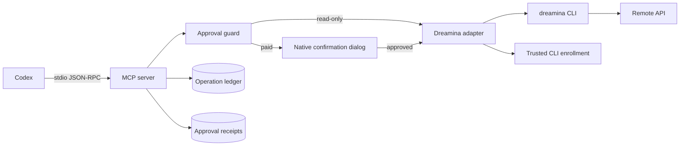

# Dreamina Design Plugin


> Create Dreamina images and videos from your supported coding agent, with runtime CLI discovery, explicit approval for every paid call, and submissions you can resume by identifier.

[](https://github.com/full-aigc-plugins/dreamina-design-plugin/releases/tag/v0.4.4)
[](LICENSE)

[English](README.md) | [简体中文](README.zh-CN.md) · [Install](#installation) · [Quick start](#quick-start) · [MCP tools](#mcp-tools) · [Troubleshooting](#troubleshooting)

## Positioning

`dreamina-design` exposes the official Dreamina CLI to supported coding-agent hosts through a local stdio MCP server with 21 typed tools. Every paid call passes a server-side confirmation, every submission gets a stable `submit_id`, and every task is queried before it is ever resubmitted.

The plugin is a strict wrapper: the CLI owns authentication and the remote API, model parameters come from the live CLI schema, and no tool accepts arbitrary shell input.

### Who it is for

- Designers and marketers who want image and video generation inside their coding agent without losing control of spend.
- Engineers who need a typed, auditable MCP surface over a vendor CLI.
- Reviewers who need an approval record and a resumable submission identity for every paid action.

### What problem it solves

| Problem | What this plugin provides | Verifiable entry point |
|---|---|---|
| CLI options drift | Capability snapshot and CLI status tools read the live CLI | `dreamina_capability_snapshot`, `dreamina_cli_status` |
| Paid calls happen by accident | A native confirmation dialog whose default action is Cancel | `scripts/native_approval.py` |
| Ambiguous results invite duplicates | Query by `submit_id`; never mint a replacement | `scripts/operation_ledger.py` |
| Untrusted CLI binaries | Trust enrollment with an absolute path, owner check, and SHA-256 | `scripts/trusted_cli.py` |

## At a glance

```text
Creative intent
      │
      ▼
┌──────────────────────────────────────────────────────────┐
│ dreamina-design                                    │
│  ① discover   live CLI capability snapshot and status    │
│  ② contract   validated generation request               │
│  ③ approve    native confirmation for paid calls         │
│  ④ submit     once, with a stable submit_id              │
│  ⑤ query      by submit_id and optionally download       │
│  ⑥ validate   artifact verification on arrival           │
└──────────────────────────────────────────────────────────┘
      │
      ▼
Downloaded image or video artifact + operation receipt
```

| Property | Value |
|---|---|
| Plugin ID | `dreamina-design` |
| Host | Codex CLI or ChatGPT desktop app |
| Current version | `0.4.4` |
| Plugin manifest | `.codex-plugin/plugin.json` |
| MCP configuration | `.mcp.json` — local stdio server |
| Primary language | Python 3.13 |
| License | Apache-2.0 |

## Capabilities and boundaries

### Supported

| Capability | Input | Output | Limit | Status |
|---|---|---|---|---|
| Capability discovery | A live CLI | Verified capability snapshot and CLI status | Read-only | Stable |
| CLI management | Install or upgrade request | Verified installation from the fixed HTTPS installer | Requires approval | Stable |
| Authentication | OAuth request | Login, check, relogin, or logout | Requires approval | Stable |
| Image generation | An approved request | One submitted image task | Consumes credits | Stable |
| Video generation | An approved request | One submitted video task | Consumes credits; some modes require web-side prerequisites | Stable |
| Task handling | A `submit_id` | Status and optional verified download | Query-only; never resubmits | Stable |
| Session management | Session request | Create, list, search, rename, delete | Requires approval for writes | Stable |
| Diagnostics | A log request | Bounded, redacted CLI log excerpt | Read-only | Stable |
| Reference-video project | Project workflow request | Versioned project, quote, execution, composition, export | The new project tools are recorded `NOT_RUN` at runtime | Experimental |

### Not responsible for

- Owning authentication. The `dreamina` CLI owns it; this repository wraps it through an argv-only adapter.
- Deciding to spend. Only an explicit approval, confirmed in a native dialog, releases a paid call.
- Bypassing web-only prerequisites. When a video mode needs something done on the web, the plugin reports it.
- Retrying submissions. An uncertain result is queried by `submit_id`, never resubmitted.
- Arbitrary shell or argv execution. No tool exposes a free-form command.

### Maturity

| Status | Meaning |
|---|---|
| Stable | Automated tests plus recorded runtime evidence |
| Experimental | Contract is still evolving; the runtime gate is `NOT_RUN` |
| Blocked / NOT_RUN | Not verified; never present it as available |

## Architecture and core flow



### Component responsibilities

| Component | Owns | Does not own |
|---|---|---|
| `scripts/dreamina_mcp_server.py` | Tool dispatch, error envelopes, stdio JSON-RPC | Vendor behaviour |
| `scripts/dreamina_adapter.py` | argv-only CLI invocation and typed failures | Approval decisions |
| `scripts/approval_guard.py` | Single-use approval receipts and replay rejection | Cost estimation |
| `scripts/operation_ledger.py` | Receipts keyed by `submit_id` | Authentication |
| `scripts/trusted_cli.py` | Trust enrollment and protected storage of the CLI identity | CLI installation |
| `scripts/native_approval.py` | The fail-closed confirmation dialog | Business rules |
| `scripts/image_service.py`, `scripts/video_service.py`, `scripts/task_service.py` | Request construction, submission, and query | Catalog values |
| `skills/` (17) | Routing and per-capability instructions for supported hosts | Runtime enforcement |

## Compatibility

| Plugin version | Host | CLI | Python | Status |
|---|---|---|---|---|
| `0.4.0` | Codex CLI or ChatGPT desktop app | `dreamina` CLI installed from the official installer and enrolled | 3.13 | Stable tools verified |
| `0.4.0` | Codex CLI or ChatGPT desktop app | same | 3.13 | The 10 reference-video project tools are `NOT_RUN` at runtime |

The paid canary gate is recorded separately; it is either separately approved or marked `NOT_RUN`. Runtime gate lines are published and checked by:

```bash
python3 scripts/validate_distribution_v7.py --plan-gate
python3 scripts/validate_distribution_v7.py --require-runtime-gates
```

## Installation

### Prerequisites

- Python 3.13 available to the MCP server.
- The `dreamina` CLI, installed from <https://jimeng.jianying.com/cli> and enrolled through the native trust dialog.
- Optional, for the reference-video project tools only: `ffmpeg`, `ffprobe`, a Whisper-compatible ASR runtime, and macOS `say`.

### From the plugin marketplace

```bash
codex plugin marketplace add full-aigc-plugins/dreamina-design-plugin --ref v0.4.4
codex plugin add dreamina-design@partme-ai-dreamina-design
```

Restart Codex or the ChatGPT desktop app, then open a new task so the MCP server starts and the Skills load.

### Confirm it loaded

```bash
codex plugin list
```

Expected entry:

```text
dreamina-design@partme-ai-dreamina-design  installed, enabled
```

Then confirm the MCP server is registered and the CLI is trusted:

```bash
codex mcp list
```

Ask Codex to read the CLI status and account readiness. The read-only tools run without a prompt; the paid tools raise a native confirmation.

### China mirror (AtomGit)

If GitHub is slow or unreachable, install from the AtomGit mirror instead. The
commands are identical apart from the marketplace URL:

```bash
codex plugin marketplace add https://atomgit.com/partme-ai/partme-dreamina-design.git --ref main
codex plugin add dreamina-design@partme-ai-dreamina-design
```

To install the whole partme-ai plugin catalog from the mirror in one step:

```bash
codex plugin marketplace add https://atomgit.com/partme-ai/plugins.git
codex plugin add dreamina-design@partme-ai-dreamina-design
```

Notes:

- The AtomGit source and the GitHub source share marketplace names, so adding
  one replaces the other. Switch back with
  `codex plugin marketplace add https://github.com/partme-ai/plugins.git`.
- For ZCode or Kimi, clone the mirror repository and register the local
  directory in the respective marketplace configuration.

## Quick start

### 1. Enrol the CLI once

The first tool call that needs the CLI asks you to confirm the binary's absolute path and digest in a native dialog whose default action is Cancel.

### 2. Create an image

```text
Create a Dreamina image from this brief: a matte ceramic teapot on a linen table, soft morning light.
```

Expected observation: a capability snapshot, a validated request, a native confirmation with the exact parameters, then a single submission with a `submit_id`.

### 3. Query and download

```text
Query that task and download the result.
```

Expected observation: the task is queried by `submit_id` and the artifact is verified on arrival. If the result is still pending, the plugin reports the state instead of resubmitting.

## Configuration

| Setting | Location | Notes |
|---|---|---|
| MCP server | `.mcp.json` | stdio; startup timeout 10s, tool timeout 3600s |
| Tool approval mode | `.mcp.json` | `approve` for read-only tools, `prompt` for paid and mutating tools |
| Trusted CLI record | `~/.config/dreamina-design/trusted-cli.json` | File mode `0600`, directory mode `0700`; stores the path and digest |
| State root | `~/.local/share/dreamina-design/` | Holds `operations/` and `approvals/` |
| CLI diagnostics | `~/.dreamina_cli/logs` | Read through the bounded, redacted diagnostic tool |
| Environment passed through | `HOME`, `TMPDIR`, `LANG`, `LC_ALL`, `PATH` | Declared in `.mcp.json` |

## MCP tools

### Read-only tools, auto-approved

| Tool | Purpose |
|---|---|
| `dreamina_capability_snapshot` | Read the verified CLI capability snapshot |
| `dreamina_cli_status` | Inspect the CLI installation, version, and command help |
| `dreamina_account` | Read redacted account and credit readiness |
| `dreamina_query_task` | Query a `submit_id` and optionally download |
| `dreamina_list_tasks` | List tasks with bounded filters |
| `dreamina_diagnose` | Read bounded, redacted CLI logs |
| `dreamina_quote_video_batch` | Enumerate exact requests and return an immutable quote |

### Paid or mutating tools, requiring a native confirmation

| Tool | Purpose |
|---|---|
| `dreamina_cli_install_or_upgrade` | Install or upgrade from the fixed HTTPS installer |
| `dreamina_auth` | OAuth login, check, relogin, or logout |
| `dreamina_submit_image` | Submit one approved paid image request |
| `dreamina_submit_video` | Submit one approved paid video request |
| `dreamina_session` | Create, list, search, rename, or delete a Session |
| `dreamina_video_project` | Create, inspect, list, or resume a video project and enrol media tools |
| `dreamina_analyze_reference_video` | Seed a source video and derive frames, sheets, and a recut |
| `dreamina_validate_shot_analysis` | Persist semantic shot annotations |
| `dreamina_create_redesign` | Create a creative-design version, original or authorized replication |
| `dreamina_approve_video_batch` | Activate one non-expandable whole-batch allowance after native confirmation |
| `dreamina_execute_video_batch` | Run, reconcile, or resume an activated batch |
| `dreamina_evaluate_video_batch` | Record measured and semantic gates for one shot attempt |
| `dreamina_compose_video` | Build a closed timeline and render a temporary final MP4 |
| `dreamina_export_video_project` | Verify the rendered MP4 and export it to an approved destination |

### Error envelope

Failures return a structured envelope: `error_type`, `message`, `retryable`, `requires_user_action`, and `next_action`. `next_action` is one of `request_user_action`, `query_same_submit_id`, or `correct_request`.

## Retry, idempotency, and recovery

- Unknown results are queried by `submit_id`; submissions are never blindly retried.
- An ambiguous submission consumes its reservation and enters manual review rather than retrying.
- Approval receipts are single-use, expire after five minutes, and are bound to the session and request.
- Task status strings are normalized, so `querying`, `queued`, `pending`, `processing`, `running`, and `generating` all report as `querying`.
- Terminal operation states are `succeeded`, `failed`, and `cancelled`.
- Local upload inputs are contained by `scripts/reference_policy.py`: at most 50 MiB per image and 512 MiB per media file, with type and containment checks.

## Data and state

| Data | Location | Lifecycle | Secrets |
|---|---|---|---|
| Operation receipt | `~/.local/share/dreamina-design/operations/` | Until you delete it | No; identifiers, hashes, states, timestamps |
| Approval receipt | `~/.local/share/dreamina-design/approvals/` | Five minutes or single use | No; credential-like keys are stripped before persistence |
| Trusted CLI record | `~/.config/dreamina-design/trusted-cli.json` | Until you re-enrol or delete it | No; path and digest only |
| Downloaded artifacts | Your chosen destination | Until you delete them | No |

## Security

- Authentication stays with the `dreamina` CLI; this repository does not store credentials.
- Every paid or mutating call passes a native confirmation dialog whose default action is Cancel.
- CLI trust requires an absolute, non-symlink path, a trusted owner and mode, and a SHA-256 digest.
- Approval persistence strips credential-like keys and rejects account-snapshot keys before writing anything.
- Tool invocations use argv arrays only; no tool accepts a free-form command string.
- Diagnostics are bounded and redacted; logs are never dumped wholesale.

## Development and verification

```bash
python3 scripts/validate_distribution.py .
python3 -m unittest discover -s tests
```

Additional gates:

```bash
python3 scripts/validate_distribution_v7.py --require-runtime-gates
python3 scripts/verify_skill_snapshot.py --strict
python3 scripts/run_strict_trace.py
python3 scripts/unlock_runtime_gates.py status
```

Recorded evidence:

- [Offline verification](docs/verification/offline.md) and the reference-video runtime record `docs/verification/reference-video-runtime-2026-09-14.md`. The ten reference-video gate lines are recorded `NOT_RUN`.
- [Skill discovery](docs/verification/skill-discovery.md) and [strict TRACE](docs/verification/skill-trace.md).
- [Authorization decision record](docs/verification/authorization-decision.md) and the paid canary records.
- [CLI runtime](docs/verification/dreamina-cli-runtime.md), plus the recorded CLI help, schema, and digest.

## Troubleshooting

| Symptom | Check first | Resolution |
|---|---|---|
| Tools are missing | `codex mcp list` | Confirm the plugin is enabled and open a new task |
| A paid call is blocked | The confirmation dialog | Confirm explicitly; the default action is Cancel |
| The CLI is not trusted | The trust record | Re-enrol the CLI and confirm the digest |
| A task looks stuck | The task state | Query by `submit_id`; do not submit again |
| A login is required | Account readiness | Use the authentication tool, then retry the read-only check |
| A video mode is refused | Web-side prerequisites | Complete the prerequisite on the web; the plugin reports rather than bypasses it |
| A reference-video tool does nothing | The runtime gate record | Those tools are recorded `NOT_RUN` until the gate passes |

## Project structure

```text
partme-dreamina-design/
├── .codex-plugin/plugin.json   # identity and presentation metadata
├── .mcp.json                   # local stdio MCP server declaration
├── .agents/plugins/marketplace.json
├── scripts/                    # MCP server, adapter, services, guards, validators
├── skills/                     # 17 Skills, 13 pinned to the upstream snapshot
├── tests/                      # unit and contract tests
└── docs/                       # architecture, technical solution, verification records
```

## Deep links

- [Architecture](docs/Dreamina-Design-Plugin-Architecture.md) · [架构文档](docs/Dreamina-Design-Plugin-Architecture.zh_CN.md)
- [Technical solution](docs/Dreamina-Design-Plugin-Technical-Solution.md) · [技术方案](docs/Dreamina-Design-Plugin-Technical-Solution.zh_CN.md)
- [Design spec](docs/superpowers/specs/2026-09-11-dreamina-design-plugin-design.md)
- [Production-readiness hardening plan](docs/superpowers/plans/2026-09-12-production-readiness-hardening.md)

## Contributing and support

Open functional issues at <https://github.com/full-aigc-plugins/dreamina-design-plugin/issues>. Before proposing a change, state the CLI version you verified against, whether it alters the approval envelope or the receipt format, and include the affected gate output.

## License

Apache-2.0 — see [LICENSE](LICENSE).
