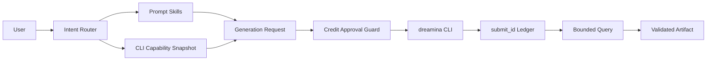

# Codex Dreamina Design Plugin Architecture

> Target architecture, not implemented. Updated 2026-09-11.

## Context

## Bounded contexts

| Context | Responsibility |
|---|---|
| Prompt | expressive content without inventing unsupported parameters |
| Capability | live models, resolutions, ratios, duration and flags |
| Generation | normalized image/video request and request fingerprint |
| Approval | exact cost/scope confirmation before submission |
| Operation | submit ID, terminal state, recovery and history |
| Artifact | downloads, checksums, media metadata and provenance |

## Runtime rules

The CLI is the remote authority. The plugin does not implement private Dreamina APIs. Each generation is submitted once; timeouts enter `Unknown` and reconcile through query/history. The result is not complete until artifact verification succeeds.

## Skill topology

`dreamina-skills` remains the reusable Skill fact source. This plugin packages design/prompt/CLI subsets under `codex-dreamina-*` orchestration without duplicating Skill bodies.

## Security

No credentials in manifests, logs, prompts, ledgers, or artifacts. Local reference files require explicit scope and type/size validation. Paid actions require action-time confirmation.
