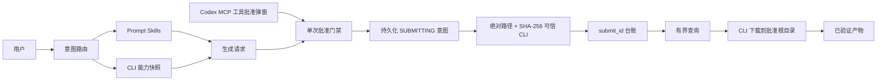

# Codex Dreamina Design 插件架构

> 功能架构已实现，生产加固进行中。重新验证日期 2026-09-13。

## 系统上下文

## 限界上下文

| 上下文 | 职责 |
|---|---|
| Prompt | 表达内容，不虚构不支持参数 |
| Capability | 实时模型、分辨率、比例、时长和参数 |
| Generation | 规范图片/视频请求与请求指纹 |
| Approval | 提交前确认精确费用和范围 |
| Operation | submit ID、终态、恢复和历史 |
| Artifact | 下载、校验和、媒体元数据和来源 |

## 运行规则

CLI 是远程事实权威，插件不实现 Dreamina 私有 API。每个生成请求只提交一次；超时进入 `Unknown`，通过查询/历史对账。产物验证完成后才可宣布任务完成。

## Skill 拓扑

`dreamina-skills` 是可复用 Skill 事实源。本插件完整打包各 Skill 目录，
并通过 `skills/.upstream-commit` 固定提交后逐文件验证字节一致性。

## 安全

manifest、日志、Prompt、台账和产物中不得出现凭据。本地参考文件必须通过
批准根目录、普通文件、类型和大小校验。付费动作只通过配置了
`approval_mode: prompt` 的 MCP 工具暴露；调用方自报身份不能作为授权证据。
