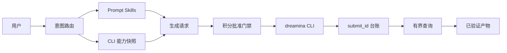

# Codex Dreamina Design 插件架构

> 目标架构，尚未实现。更新日期 2026-09-11。

## 系统上下文

## 限界上下文

| 上下文 | 职责 |
|---|---|
| Prompt | 表达内容，不虚构不支持参数 |
| Capability | 实时模型、分辨率、比例、时长和参数 |
| Generation | 规范图片/视频请求与请求指纹 |
| Approval | 提交前确认精确费用和范围 |
| Operation | submit ID、终态、恢复和历史 |
| Artifact | 下载、校验和、媒体元数据和来源 |

## 运行规则

CLI 是远程事实权威，插件不实现 Dreamina 私有 API。每个生成请求只提交一次；超时进入 `Unknown`，通过查询/历史对账。产物验证完成后才可宣布任务完成。

## Skill 拓扑

`dreamina-skills` 是可复用 Skill 事实源。本插件打包设计、Prompt、CLI 子集，通过 `codex-dreamina-*` 编排，不复制 Skill 正文。

## 安全

manifest、日志、Prompt、台账和产物中不得出现凭据。本地参考文件需要明确授权范围并校验类型/大小。付费动作必须在动作发生前确认。
