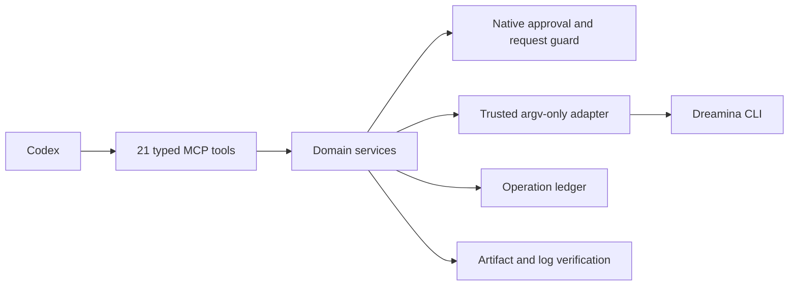
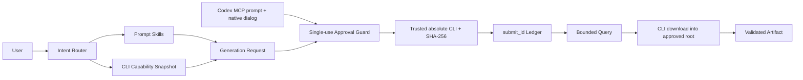

# Dreamina Design Plugin Architecture

> **Document control**
>
> | Field | Value |
> |---|---|
> | Status | Feature set implemented as `0.4.0`; the reference-video project tools are recorded `NOT_RUN` at runtime |
> | Scope | How Codex drives the installed `dreamina` CLI through a typed MCP server with explicit approval |
> | Audience | Plugin maintainers, security reviewers, and integrators |
> | Out of scope | The Dreamina service, account entitlement, and media generation quality |
> | Runtime evidence | `docs/verification/` |
> | Last structural revision | 2026-09-14 |

## 1. Executive summary

The plugin exposes the official Dreamina CLI to Codex through a local stdio MCP server with 21 typed tools. Eleven cover the CLI lifecycle: status, verified install and upgrade, OAuth flows, account readiness, image and video generation, task query and listing, Session management, and redacted log diagnosis. Ten more cover the reference-video project workflow: project lifecycle, reference analysis, shot annotation, redesign, batch quote and approval, batch execution, evaluation, composition, and export.

Two invariants define the architecture:

- no tool executes arbitrary shell or argv; domain services construct fixed arguments;
- a paid or mutating action requires a server-side native confirmation whose default action is Cancel, in addition to the MCP approval metadata.

### Runtime honesty

| Surface | State |
|---|---|
| The eleven CLI-lifecycle tools | Implemented and exercised with recorded runtime evidence |
| The ten reference-video project tools | Implemented; every runtime gate line is recorded `NOT_RUN` |
| The paid canary | Recorded separately as approved or `NOT_RUN` |

## 2. Drivers and constraints

| Driver | Consequence for the architecture |
|---|---|
| The CLI owns authentication and the remote API | The plugin wraps it through a typed, argv-only adapter |
| Spending credits is irreversible | Approval is a single-use persisted receipt bound to an exact request fingerprint |
| Long generation tasks outlive a call | Every task is queryable by `submit_id`, and a timeout enters `Unknown` rather than resubmitting |
| CLI binaries can be replaced or tampered with | Identity is enrolled once from a private trust record with an absolute path and SHA-256 |
| Reference media is user data | Local inputs are contained by root, type, and size policy before any call |

### Non-goals

- Reimplementing private Dreamina APIs or the CLI's internals.
- Choosing creative parameters on the user's behalf.
- Retrying a paid operation automatically.
- Reading or storing credentials; the CLI owns them.

## 3. Context and trust boundary





| Boundary | Inside | Outside |
|---|---|---|
| This repository | MCP server, domain services, guards, ledger, adapter, validators | Generation and billing |
| The CLI | Authentication, remote API, catalog, task state | Invoked through fixed argv only |
| The service | Generation, credits, artifact lifetime | Reached only through the CLI |

## 4. Current state, target state, and gaps

| Capability | Current | Target | Gap |
|---|---|---|---|
| CLI lifecycle tools | Eleven tools, runtime verified | Unchanged | None |
| Capability discovery | Live CLI help and schema snapshots | Unchanged | None |
| Approval enforcement | Single-use receipts plus a native dialog | Unchanged | None |
| Submission identity | `submit_id` persisted before success is reported | Unchanged | None |
| Artifact verification | Checksums and media metadata | Unchanged | None |
| Reference-video project tools | Implemented; all ten runtime gate lines `NOT_RUN` | Authorized runtime acceptance | Requires explicit authorization and an approved paid canary |
| Credential handling | Not owned | Not owned | Intentionally absent |

## 5. Principles and decisions

| Decision | Rationale | Reversal condition |
|---|---|---|
| Wrap, never reimplement | The CLI is the supported interface and owns authentication | None |
| Fixed argv from domain services | Removes the ability to inject commands through a tool argument | None |
| Single-use approval bound to a fingerprint | An approval for one request must never authorize another | None |
| Persist `submit_id` before reporting success | A crash must not lose the only handle to a paid task | None |
| Enrol CLI identity once | A replaced binary would otherwise inherit trust | If the platform provides signed binary identity |
| Contain reference inputs | The plugin must not read or upload arbitrary local paths | None |

## 6. Components and dependencies

| Component | Owns | Does not own |
|---|---|---|
| `scripts/dreamina_mcp_server.py` | Tool dispatch, error envelopes, stdio JSON-RPC | Vendor behaviour |
| `scripts/video_project_mcp.py` | The ten reference-video project tools | Media generation |
| `scripts/dreamina_adapter.py` | argv-only CLI invocation and typed failures | Approval decisions |
| `scripts/approval_guard.py` | Single-use approval receipts and replay rejection | Cost estimation |
| `scripts/operation_ledger.py` | Receipts keyed by `submit_id` | Authentication |
| `scripts/trusted_cli.py` | Trust enrolment and protected CLI identity storage | CLI installation |
| `scripts/native_approval.py` | The fail-closed native confirmation | Business rules |
| `scripts/video_project_store.py` | Versioned project state with compare-and-swap transitions | Generation |
| `scripts/reference_policy.py` | Containment, type, and size policy for local inputs | Upload |
| `skills/` (17) | Routing and per-capability instructions | Runtime enforcement |

Dependency direction is one-way: tools call services, services call the guard and the adapter, and only the adapter reaches the CLI.

## 7. Runtime and core flows

### 7.1 Bounded contexts

| Context | Responsibility |
|---|---|
| Prompt | expressive content without inventing unsupported parameters |
| Capability | live models, resolutions, ratios, duration and flags |
| Generation | normalized image/video request and request fingerprint |
| Approval | exact cost/scope confirmation before submission |
| Operation | submit ID, terminal state, recovery and history |
| Artifact | downloads, checksums, media metadata and provenance |

### 7.2 Failure and recovery semantics

| Failure | Detection | Behavior | Recovery |
|---|---|---|---|
| Missing or expired login | Adapter outcome | Typed `requires_user_action` with `login` | Re-authenticate |
| Permission or entitlement denied | Adapter outcome | `next_action` is `request_user_action` | Resolve entitlement, then retry |
| Ambiguous submission | Adapter marks the outcome ambiguous | Reservation is consumed; the operation enters manual review | Query the known `submit_id`; never resubmit |
| Task still running | Status normalization | Reported as `querying` | Query again |
| Timeout on a paid call | Adapter timeout | No automatic replay | Query by `submit_id` |
| Artifact mismatch | Checksum verification | Reported as failure | Re-download the same task |
| Untrusted CLI binary | Trust record mismatch | Native confirmation is required | Re-enrol the CLI |

The result is not complete until artifact verification succeeds, and terminal states are `succeeded`, `failed`, and `cancelled`.

## 8. State, data, and protocol

| Data | Owner | Location | Consistency |
|---|---|---|---|
| Operation receipt | This plugin | `~/.local/share/dreamina-design/operations/` | Atomic write with a lock; keyed by `submit_id` |
| Approval receipt | Approval guard | `~/.local/share/dreamina-design/approvals/` | Single use, five-minute lifetime, credential-like keys stripped |
| Trust record | Trusted CLI store | `~/.config/dreamina-design/trusted-cli.json`, file `0600`, directory `0700` | Written only after native confirmation |
| Video project state | Project store | `~/.local/share/dreamina-design/` | Compare-and-swap transitions over a versioned state machine |
| Downloaded artifact | Caller | Approved destination root | Checksum and media metadata recorded |
| Credentials | The CLI | CLI-owned | Never read or written here |

Protocol surface: stdio JSON-RPC with a structured error envelope carrying `error_type`, `message`, `retryable`, `requires_user_action`, and `next_action`.

## 9. Security

- No credential appears in manifests, logs, prompts, ledgers, or artifacts; the CLI owns authentication.
- Paid and mutating tools are configured with `approval_mode: prompt` and independently require a server-side native dialog whose default action is Cancel.
- Approval persistence strips credential-like keys and rejects account-snapshot keys before writing.
- CLI identity comes only from a separately enrolled private trust record with an absolute, non-symlink path and a verified digest.
- Local reference inputs are validated for approved root, regular-file type, and size (50 MiB per image, 512 MiB per media file).
- Tool arguments never become a command string; the adapter builds argv arrays.

## 10. Resource and operational budgets

| Budget | Value | Rationale |
|---|---|---|
| MCP startup timeout | 10 seconds | The server is local and stdlib-only |
| MCP tool timeout | 3600 seconds | Some generation and composition steps are long |
| Approval lifetime | Five minutes, single use | An approval is a decision about one request at one time |
| Query retries | Bounded polling | A task may outlive a turn, but polling must not become a loop |
| Skill snapshot parity | Byte-verified per file | Upstream drift must fail the build, not surprise the user |

### Operations

```bash
python3 scripts/validate_distribution.py .
python3 -m unittest discover -s tests
python3 scripts/validate_distribution_v7.py --require-runtime-gates
python3 scripts/verify_skill_snapshot.py --strict
python3 scripts/unlock_runtime_gates.py status
```

## 11. Deployment, compatibility, and evolution

| Aspect | Position |
|---|---|
| Distribution | Cross-host marketplace entry pointing at this repository, pinned to immutable `v0.4.4` |
| Python | 3.13 |
| CLI | Installed from the official installer and enrolled through native trust |
| Skill topology | `dreamina-skills` remains the reusable fact source; this plugin packages byte-verified Skill trees pinned by `skills/.upstream-commit` |
| Rollback | Revert the plugin; receipts remain readable because their format is additive |

| Risk | Mitigation |
|---|---|
| Upstream Skill drift | Byte-parity verification fails the strict gate |
| Untrusted CLI binary | Native trust enrolment with a digest check |
| Overstated readiness | The ten reference-video runtime lines are published as `NOT_RUN` |

## 12. Evidence map

| Claim | Evidence |
|---|---|
| Tool catalogue and approval modes | `.mcp.json` and `scripts/dreamina_mcp_server.py` |
| Approval enforcement | `scripts/approval_guard.py` and `scripts/native_approval.py` |
| Idempotent submission | `scripts/image_service.py`, `scripts/video_service.py`, and `scripts/operation_ledger.py` |
| Reference-video gates | `docs/verification/reference-video-runtime-2026-09-14.md` |
| Skill snapshot parity | `scripts/verify_skill_snapshot.py` output |
| Paid canary | `docs/verification/paid-canary-approved.md` |
