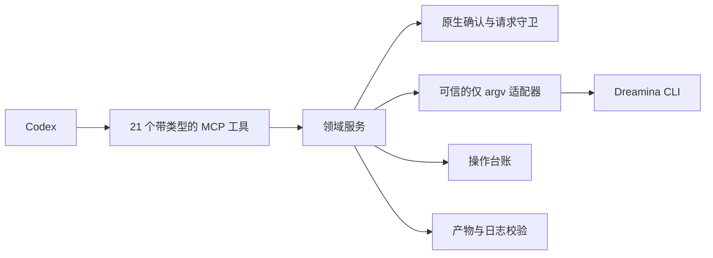
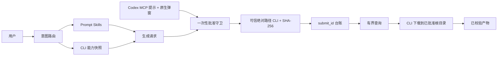

# Dreamina Design 插件架构

> **文档信息**
>
> | 字段 | 值 |
> |---|---|
> | 状态 | 功能集已实现为 `0.4.0`；参考视频工程工具的运行门禁记为 `NOT_RUN` |
> | 范围 | Codex 如何通过带类型的 MCP 服务器与显式批准驱动已安装的 `dreamina` CLI |
> | 读者 | 插件维护者、安全审阅者与集成者 |
> | 不在范围 | Dreamina 服务、账号权益与媒体生成质量 |
> | 运行证据 | `docs/verification/` |
> | 最近一次结构修订 | 2026-09-14 |

## 1. 执行摘要

插件通过本地 stdio MCP 服务器，以 21 个带类型的工具把官方 Dreamina CLI 暴露给 Codex。其中 11 个覆盖 CLI 生命周期：状态、可信安装与升级、OAuth 流程、账号就绪度、图片与视频生成、任务查询与列表、Session 管理，以及脱敏日志诊断。另外 10 个覆盖参考视频工程工作流：工程生命周期、参考分析、分镜标注、重设计、整批报价与批准、整批执行、评测、合成与导出。

两条不变量定义了这套架构：

- 没有任何工具执行任意 shell 或 argv；领域服务构造固定参数；
- 付费或写类动作除 MCP 批准元数据外，还必须通过一个默认动作为"取消"的服务端原生确认。

### 运行诚实度

| 界面 | 状态 |
|---|---|
| 11 个 CLI 生命周期工具 | 已实现，且有记录的运行证据 |
| 10 个参考视频工程工具 | 已实现；所有运行门禁条目均记为 `NOT_RUN` |
| 付费金丝雀 | 单独记录为已批准或 `NOT_RUN` |

## 2. 驱动力与约束

| 驱动力 | 对架构的后果 |
|---|---|
| CLI 拥有认证与远端 API | 插件通过带类型、仅用 argv 的适配器包装它 |
| 花费额度不可逆 | 批准是一次性持久回执，绑定到确切的请求指纹 |
| 长生成任务比一次调用活得更久 | 每个任务都能按 `submit_id` 查询，超时进入 `Unknown` 而不是重新提交 |
| CLI 二进制可能被替换或篡改 | 身份通过私有信任记录一次性登记，含绝对路径与 SHA-256 |
| 参考媒体属于用户数据 | 本地输入在调用前按根目录、类型与大小策略受限 |

### 非目标

- 重实现 Dreamina 私有 API 或 CLI 内部实现。
- 替用户做创作参数决策。
- 自动重试付费操作。
- 读取或存储凭据；凭据由 CLI 持有。

## 3. 上下文与信任边界





| 边界 | 内部 | 外部 |
|---|---|---|
| 本仓库 | MCP 服务器、领域服务、守卫、台账、适配器、校验器 | 生成与计费 |
| CLI | 认证、远端 API、目录、任务状态 | 仅通过固定 argv 调用 |
| 服务 | 生成、额度、产物生命周期 | 只经由 CLI 触达 |

## 4. 当前状态、目标状态与差距

| 能力 | 当前 | 目标 | 差距 |
|---|---|---|---|
| CLI 生命周期工具 | 11 个工具，运行期已验证 | 不变 | 无 |
| 能力发现 | 实时 CLI help 与 schema 快照 | 不变 | 无 |
| 批准强制 | 一次性回执 + 原生弹窗 | 不变 | 无 |
| 提交标识 | 报告成功之前先持久化 `submit_id` | 不变 | 无 |
| 产物校验 | 校验和与媒体元数据 | 不变 | 无 |
| 参考视频工程工具 | 已实现；10 条运行门禁全为 `NOT_RUN` | 经授权的实机验收 | 需要明确授权与已批准的付费金丝雀 |
| 凭据处理 | 不拥有 | 不拥有 | 有意缺失 |

## 5. 原则与决策

| 决策 | 理由 | 反转条件 |
|---|---|---|
| 只包装，不重实现 | CLI 是受支持的接口，并持有认证 | 无 |
| 领域服务构造固定 argv | 彻底消除通过工具参数注入命令的可能 | 无 |
| 一次性批准绑定指纹 | 针对一个请求的批准绝不能授权另一个 | 无 |
| 报告成功前先持久化 `submit_id` | 崩溃不得丢失通往付费任务的唯一句柄 | 无 |
| 一次性登记 CLI 身份 | 否则被替换的二进制会继承信任 | 若平台提供二进制签名身份 |
| 约束参考输入 | 插件不得读取或上传任意本地路径 | 无 |

## 6. 组件与依赖

| 组件 | 负责 | 不负责 |
|---|---|---|
| `scripts/dreamina_mcp_server.py` | 工具分发、错误信封、stdio JSON-RPC | 厂商行为 |
| `scripts/video_project_mcp.py` | 10 个参考视频工程工具 | 媒体生成 |
| `scripts/dreamina_adapter.py` | 仅用 argv 调用 CLI 并给出带类型的失败 | 批准决策 |
| `scripts/approval_guard.py` | 一次性批准回执与拒绝重放 | 成本估算 |
| `scripts/operation_ledger.py` | 以 `submit_id` 为键的回执 | 认证 |
| `scripts/trusted_cli.py` | 信任登记与受保护的 CLI 身份存储 | CLI 安装 |
| `scripts/native_approval.py` | 失败即关闭的原生确认 | 业务规则 |
| `scripts/video_project_store.py` | 带 compare-and-swap 迁移的版本化工程状态 | 生成 |
| `scripts/reference_policy.py` | 本地输入的边界、类型与大小策略 | 上传 |
| `skills/`（17 个） | 路由与逐能力指令 | 运行时强制 |

依赖方向是单向的：工具调用服务，服务调用守卫与适配器，只有适配器触达 CLI。

## 7. 运行期与核心流程

### 7.1 限界上下文

| 上下文 | 职责 |
|---|---|
| Prompt | 只表达内容，不臆造不受支持的参数 |
| Capability | 实时模型、分辨率、比例、时长与参数 |
| Generation | 规范化的图片/视频请求与请求指纹 |
| Approval | 提交前的确切成本与范围确认 |
| Operation | 提交 ID、终态、恢复与历史 |
| Artifact | 下载、校验和、媒体元数据与来源 |

### 7.2 失败与恢复语义

| 失败 | 检测方式 | 行为 | 恢复 |
|---|---|---|---|
| 登录缺失或过期 | 适配器结果 | 带类型的 `requires_user_action`，值为 `login` | 重新认证 |
| 权限或权益被拒 | 适配器结果 | `next_action` 为 `request_user_action` | 解决权益问题后重试 |
| 提交结果含糊 | 适配器标记结果含糊 | 预留被消耗；操作进入人工复核 | 查询已知 `submit_id`；绝不重新提交 |
| 任务仍在进行 | 状态归一 | 报告为 `querying` | 再次查询 |
| 付费调用超时 | 适配器超时 | 不自动重放 | 按 `submit_id` 查询 |
| 产物不匹配 | 校验和校验 | 报告为失败 | 重新下载同一任务 |
| CLI 二进制不可信 | 信任记录不匹配 | 需要原生确认 | 重新登记 CLI |

在产物校验成功之前，结果都不算完成；终态为 `succeeded`、`failed` 与 `cancelled`。

## 8. 状态、数据与协议

| 数据 | 所有者 | 位置 | 一致性 |
|---|---|---|---|
| 操作回执 | 本插件 | `~/.local/share/dreamina-design/operations/` | 带锁的原子写；以 `submit_id` 为键 |
| 批准回执 | 批准守卫 | `~/.local/share/dreamina-design/approvals/` | 一次性、五分钟有效期、剥离形似凭据的键 |
| 信任记录 | 受信 CLI 存储 | `~/.config/dreamina-design/trusted-cli.json`，文件 `0600`、目录 `0700` | 仅在原生确认后写入 |
| 视频工程状态 | 工程存储 | `~/.local/share/dreamina-design/` | 版本化状态机上的 compare-and-swap 迁移 |
| 已下载产物 | 调用方 | 已批准的下载根目录 | 记录校验和与媒体元数据 |
| 凭据 | CLI | CLI 持有 | 本仓库从不读写 |

协议面：stdio JSON-RPC，错误信封携带 `error_type`、`message`、`retryable`、`requires_user_action` 与 `next_action`。

## 9. 安全

- 清单、日志、Prompt、台账与产物中都不出现凭据；认证由 CLI 持有。
- 付费与写类工具配置为 `approval_mode: prompt`，并独立要求一个默认动作为"取消"的服务端原生弹窗。
- 批准持久化会剥离形似凭据的键，并在写入前拒绝账号快照类键。
- CLI 身份只来自单独登记的私有信任记录，要求绝对且非符号链接的路径与已校验摘要。
- 本地参考输入按已批准根目录、常规文件类型与大小（单图 50 MiB、单媒体 512 MiB）校验。
- 工具参数永远不会变成命令字符串；适配器只构造 argv 数组。

## 10. 资源与运行预算

| 预算 | 值 | 理由 |
|---|---|---|
| MCP 启动超时 | 10 秒 | 服务器是本地且仅用标准库的 |
| MCP 工具超时 | 3600 秒 | 部分生成与合成步骤很长 |
| 批准有效期 | 五分钟、一次性 | 批准是对"某一时刻某一个请求"的决定 |
| 查询重试 | 有界轮询 | 任务可能比一轮对话活得更久，但轮询不能变成循环 |
| Skill 快照一致性 | 逐文件字节校验 | 上游漂移必须让构建失败，而不是让用户意外 |

### 运行

```bash
python3 scripts/validate_distribution.py .
python3 -m unittest discover -s tests
python3 scripts/validate_distribution_v7.py --require-runtime-gates
python3 scripts/verify_skill_snapshot.py --strict
python3 scripts/unlock_runtime_gates.py status
```

## 11. 部署、兼容性与演进

| 方面 | 立场 |
|---|---|
| 分发 | 指向本仓库、固定到不可变 `v0.4.4` 的跨宿主 marketplace 条目 |
| Python | 3.13 |
| CLI | 从官方安装器安装，并通过原生信任登记 |
| Skill 拓扑 | `dreamina-skills` 仍是可复用事实源；本插件按 `skills/.upstream-commit` 打包逐字节校验的 Skill 树 |
| 回滚 | 回退插件即可；回执格式可追加，因此仍可读取 |

| 风险 | 缓解 |
|---|---|
| 上游 Skill 漂移 | 字节一致性校验会让严格门禁失败 |
| CLI 二进制不可信 | 带摘要校验的原生信任登记 |
| 过度声称就绪 | 10 条参考视频运行条目公开发布为 `NOT_RUN` |

## 12. 证据映射

| 断言 | 证据 |
|---|---|
| 工具清单与批准模式 | `.mcp.json` 与 `scripts/dreamina_mcp_server.py` |
| 批准强制 | `scripts/approval_guard.py` 与 `scripts/native_approval.py` |
| 幂等提交 | `scripts/image_service.py`、`scripts/video_service.py` 与 `scripts/operation_ledger.py` |
| 参考视频门禁 | `docs/verification/reference-video-runtime-2026-09-14.md` |
| Skill 快照一致性 | `scripts/verify_skill_snapshot.py` 的输出 |
| 付费金丝雀 | `docs/verification/paid-canary-approved.md` |
