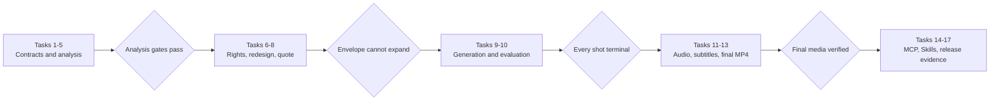

# Dreamina Reference Video Re-Director Implementation Plan

> **For agentic workers:** REQUIRED SUB-SKILL: Use superpowers:subagent-driven-development (recommended) or superpowers:executing-plans to implement this plan task-by-task. Steps use checkbox (`- [ ]`) syntax for tracking.

**Goal:** Add a resumable reference-video-to-final-MP4 production workflow to Dreamina Design without removing or changing any `0.3.0` direct image, video, account, task, Session, diagnostic, approval, or recovery capability.

**Architecture:** Keep the existing eleven MCP tools as the stable atomic Dreamina layer. Add a versioned video-project layer that separates deterministic local media evidence from Codex-authored semantics, gates original redesign or authorized replication, activates one non-expandable whole-batch allowance, generates and evaluates shots through the existing Dreamina services, and renders audio, subtitles, reports, and the final MP4 through trusted argv-only local tools.

**Tech Stack:** Python 3.11+ standard library, dependency-free stdio MCP, JSON Schema Draft 2020-12, `unittest`, existing `DreaminaAdapter`/`VideoService`/`TaskService`/`ApprovalGuard`/`OperationLedger`, trusted `ffmpeg` and `ffprobe`, optional trusted Whisper-compatible ASR, macOS `/usr/bin/say` or user-supplied narration, self-contained HTML reports.

**Spec:** `docs/superpowers/specs/2026-09-14-reference-video-redirection-design.md`

## Global Constraints

- Target release is exactly `0.4.0`; implementation and release evidence remain separate gates.
- The existing eleven MCP tool names, accepted `0.3.0` request fields, approval semantics, and structured error fields remain backward compatible.
- The thirteen upstream Dreamina Skills remain byte-identical to `full-aigc-skills/dreamina-skills@e8ae5880fb36f71c4e60ef854060ab9cadd9edc4`; new workflow Skills are plugin-owned and excluded from upstream byte-parity counts.
- ReelBench is an engineering reference pinned to `eternityspring/reelbench-skills@75520c7b32ab5af8b22c5e4f79705efbbc0d8e07`; it is not a runtime dependency and its Node/Chrome implementation is not vendored in the first release.
- Every media subprocess receives fixed argv with `shell=False`; callers can never provide shell fragments, raw argv, codec flags, or ffmpeg filter expressions.
- Machine evidence and Codex/model judgments use separate fields and fingerprints; semantic writes can never alter measured timestamps, motion, media identity, or boundary provenance.
- `original_redesign` is the default and replaces expressive content; `authorized_replication` requires a complete, unexpired, scope-matching rights receipt.
- No Dreamina paid submission occurs before design validation, exact request enumeration, cost-basis validation, quote fingerprinting, and native whole-batch approval.
- An activated batch may reduce work but cannot add shots, models, resolution, duration, references, retry variants, rights, or credit ceilings.
- Ambiguous Dreamina submissions consume their reservation and enter `manual_review`; they are queried by known `submit_id` and never resubmitted automatically.
- Source video, extracted frames, transcripts, rights evidence, generated media, and reports are private runtime artifacts and must never enter the plugin distribution or logs.
- Default source limits are 2 GiB and 1,800 seconds; larger sources fail with a typed segmentation action. Test overrides are dependency-injected and cannot be supplied through MCP.
- Final MP4 profile is H.264, `yuv420p`, `+faststart`, and constant 24, 25, or 30 fps; non-`silent` policies additionally require AAC-LC 48 kHz. Output dimensions must be even and within 360–3840 pixels per edge.
- UI-like comparison reports must remain usable at 390×884, 768×1024, and 1280×1024 viewports.
- Paid canaries, provider installation, Marketplace publication, and GitHub push each require their own action-time authorization; this plan does not grant them.

---

## File Responsibility Map

### Existing files retained or extended

- `scripts/dreamina_mcp_server.py`: stdio protocol and backward-compatible public dispatch; no project-domain logic.
- `scripts/video_service.py`: existing five direct modes plus one additive batch-allowance submission entry point.
- `scripts/task_service.py`: query/download primitive reused by the batch executor; no resubmission.
- `scripts/approval_guard.py`: existing one-request approval remains unchanged.
- `scripts/native_approval.py`: adds exact media-tool, source-processing, rights, batch-envelope, and export confirmations.
- `scripts/reference_policy.py`: existing Dreamina upload staging remains unchanged; project intake uses its own durable source service.
- `scripts/router_skill.py`: adds project-workflow routing without changing current direct-mode routes.
- `scripts/verify_skill_snapshot.py`: continues proving exactly thirteen upstream Skills while reporting plugin-owned Skills separately.
- `scripts/validate_distribution.py` and `scripts/validate_distribution_v7.py`: add project-surface, local-runtime, license, and release gates.
- `.mcp.json`: preserves current entries and adds ten explicitly classified project tools.
- `.codex-plugin/plugin.json`: release identity, version `0.4.0`, updated additive positioning and prompts.

### New focused runtime modules

- `scripts/json_contracts.py`: closed-schema loading, validation, canonical JSON, and SHA-256 fingerprints.
- `scripts/trusted_media_tools.py`: enrollment and digest revalidation for ffmpeg, ffprobe, ASR, and narration executables.
- `scripts/media_adapter.py`: bounded argv-only local process runner and ffprobe JSON parser.
- `scripts/video_project_store.py`: private project directories, immutable versions, state transitions, locks, and indexes.
- `scripts/media_intake_service.py`: source containment, no-follow copying, MIME/probe checks, and source receipt.
- `scripts/reference_video_service.py`: scene candidates, normalized cuts, motion track, keyframes, contact sheets, and typed recut.
- `scripts/shot_analysis_service.py`: semantic annotation persistence and deterministic quality gates.
- `scripts/video_rights_service.py`: rights assertion validation, native confirmation, expiry, and scope matching.
- `scripts/video_redesign_service.py`: creative-design versions, preservation policy, continuity constraints, and similarity audit.
- `scripts/video_generation_planner.py`: live-capability mode selection and exact base/retry request enumeration.
- `scripts/video_batch_allowance.py`: immutable quote, whole-batch activation, reservation, commit, and budget accounting.
- `scripts/video_batch_executor.py`: resumable generate/query/download coordination over existing services.
- `scripts/video_evaluation_service.py`: deterministic clip gates, semantic evaluation contract, decisions, and retry selection.
- `scripts/transcription_service.py`: trusted Whisper-compatible transcript provider and confidence provenance.
- `scripts/narration_service.py`: macOS `say` and user-supplied narration providers without voice cloning.
- `scripts/subtitle_service.py`: validated cue timeline plus SRT/ASS generation.
- `scripts/video_composition_service.py`: closed timeline model and internally constructed ffmpeg graph.
- `scripts/final_media_service.py`: final stream, duration, sync, loudness, subtitle, checksum, and provenance verification.
- `scripts/video_comparison_report.py`: self-contained responsive source/design/output report.
- `scripts/video_project_mcp.py`: ten new MCP definitions and handlers, leaving the stdio server thin.

### New contracts and Skills

- `schemas/video_project.schema.json`
- `schemas/source_receipt.schema.json`
- `schemas/shot_analysis.schema.json`
- `schemas/shot_annotation.schema.json`
- `schemas/video_rights_receipt.schema.json`
- `schemas/video_redesign.schema.json`
- `schemas/video_batch_quote.schema.json`
- `schemas/video_batch_allowance.schema.json`
- `schemas/shot_evaluation.schema.json`
- `schemas/audio_plan.schema.json`
- `schemas/composition_receipt.schema.json`
- `skills/codex-dreamina-video-production/SKILL.md`
- `skills/codex-dreamina-shot-annotator/SKILL.md`
- `skills/codex-dreamina-video-evaluator/SKILL.md`

---

### Task 1: Freeze the `0.3.0` Compatibility Baseline and Add Shared JSON Contracts

**Files:**
- Create: `scripts/json_contracts.py`
- Create: `tests/test_json_contracts.py`
- Create: `tests/test_reference_video_compatibility.py`
- Create: `tests/fixtures/legacy_mcp_tools_0_3_0.json`
- Create: `tests/video_project_fixtures.py`
- Modify: `tests/test_contracts.py`
- Modify: `tests/test_dreamina_mcp_server.py`

**Interfaces:**
- Consumes: current `_tool_definitions()`, current five schema files, and current eleven tool schemas.
- Produces: `load_schema(name: str) -> dict[str, Any]`, `validate_contract(payload, schema_name) -> None`, `canonical_fingerprint(payload) -> str`, a frozen `LEGACY_TOOL_CONTRACTS` fixture, and reusable deterministic video-project test builders.

- [x] **Step 1: Write characterization and contract tests**

```python
LEGACY_TOOLS = {
    "dreamina_capability_snapshot", "dreamina_cli_status",
    "dreamina_cli_install_or_upgrade", "dreamina_auth", "dreamina_account",
    "dreamina_submit_image", "dreamina_submit_video", "dreamina_query_task",
    "dreamina_list_tasks", "dreamina_session", "dreamina_diagnose",
}

def test_legacy_tool_contracts_are_unchanged():
    current = {tool["name"]: tool for tool in _tool_definitions()}
    assert LEGACY_TOOLS <= current.keys()
    assert current["dreamina_submit_video"]["inputSchema"] == LEGACY_TOOL_CONTRACTS["dreamina_submit_video"]

def test_contract_rejects_unknown_nested_property():
    with self.assertRaises(ContractValidationError):
        validate_contract({
            "mode": "text2video", "prompt": "demo", "model": "seedance-test",
            "count": 1, "unknown": True,
        }, "generation_request.schema.json")
```

- [x] **Step 2: Run the tests and verify RED**

Run: `python3 -m unittest tests.test_json_contracts tests.test_reference_video_compatibility -v`

Expected: FAIL because `scripts.json_contracts` and the new schema are absent; existing compatibility tests remain green.

- [x] **Step 3: Implement the reusable validator and canonical fingerprint**

```python
class ContractValidationError(ValueError):
    """A versioned public JSON artifact violates its closed schema."""

def load_schema(name: str) -> dict[str, Any]:
    target = (SCHEMAS_ROOT / name).resolve(strict=True)
    if target.parent != SCHEMAS_ROOT or target.suffix != ".json":
        raise ContractValidationError("unsafe schema name")
    return json.loads(target.read_text(encoding="utf-8"))

def canonical_fingerprint(payload: Mapping[str, Any]) -> str:
    encoded = json.dumps(dict(payload), sort_keys=True, separators=(",", ":"), ensure_ascii=False).encode("utf-8")
    return hashlib.sha256(encoded).hexdigest()
```

Implement closed object/array/string/number/boolean validation, `required`, `enum`, `const`, patterns, bounds, item limits, and local `$ref` resolution. Do not add a third-party Python package.

Capture the current canonical eleven-tool definitions in `legacy_mcp_tools_0_3_0.json`. In `tests/video_project_fixtures.py`, define builders with stable defaults:

```python
def project_id() -> str: return "vp_0123456789abcdef01234567"
def source_receipt() -> dict[str, Any]: return {"schema_version": "1.0", "source_sha256": "a" * 64, "duration_seconds": 12.0}
def capability_snapshot() -> dict[str, Any]: return {"cli_version": "test", "modes": ["text2video", "image2video", "frames2video", "multiframe2video", "multimodal2video"], "models": []}
def cost_basis() -> dict[str, Any]: return {"kind": "operator_ceiling", "currency": "credits", "recorded_at": "2026-09-14T00:00:00Z"}
def build_annotations(**overrides: Any) -> dict[str, Any]: return {"schema_version": "1.0", "machine_fingerprint": "b" * 64, "shots": [], **overrides}
def build_redesign(**overrides: Any) -> dict[str, Any]: return {"schema_version": "1.0", "creative_mode": "original_redesign", "machine_fingerprint": "b" * 64, "shots": [], **overrides}
def build_design_shot(**overrides: Any) -> dict[str, Any]: return {"id": "S01", "kind": "subject", "duration_seconds": 4, "references": [], **overrides}
def build_clip(shot_id: str) -> dict[str, Any]: return {"shot_id": shot_id, "path": f"/{shot_id}.mp4", "sha256": "c" * 64, "duration_seconds": 4.0}
def build_composition_plan(**overrides: Any) -> dict[str, Any]: return {"clips": [build_clip("S01")], "transitions": [], "width": 1280, "height": 720, "fps": 24, **overrides}
def fake_acceptance_dependencies() -> dict[str, Any]: return {"network": False, "native_approval": False, "paid": False, "publish": False}
def run_mcp_initialize() -> dict[str, Any]:
    message = {"jsonrpc": "2.0", "id": 1, "method": "initialize", "params": {}}
    result = subprocess.run([sys.executable, "-m", "scripts.dreamina_mcp_server"], input=json.dumps(message) + "\n", capture_output=True, text=True, check=False)
    return json.loads(result.stdout)
```

Later tasks extend these builders with fields introduced by their own schemas; builders never read real account, media, rights, or credential data.

- [x] **Step 4: Run focused and legacy contract tests**

Run: `python3 -m unittest tests.test_json_contracts tests.test_contracts tests.test_dreamina_mcp_server tests.test_reference_video_compatibility -v`

Expected: PASS; the legacy tool-schema snapshots are byte-for-byte equal after JSON canonicalization.

- [x] **Step 5: Commit the contract foundation**

```bash
git add scripts/json_contracts.py tests/test_json_contracts.py tests/test_reference_video_compatibility.py tests/fixtures/legacy_mcp_tools_0_3_0.json tests/video_project_fixtures.py tests/test_contracts.py tests/test_dreamina_mcp_server.py
git commit -m "test: freeze Dreamina 0.3 compatibility contracts"
```

### Task 2: Enroll and Execute Trusted Local Media Tools

**Files:**
- Create: `scripts/trusted_media_tools.py`
- Create: `scripts/media_adapter.py`
- Create: `tests/test_trusted_media_tools.py`
- Create: `tests/test_media_adapter.py`
- Modify: `scripts/native_approval.py`
- Create: `tests/test_native_approval.py`

**Interfaces:**
- Consumes: the ownership, permissions, digest, private-copy, timeout, and bounded-output patterns in `TrustedCliStore` and `DreaminaAdapter`.
- Produces: `TrustedMediaToolStore.enroll(kind, path, approval_provider)`, `TrustedMediaToolStore.load_required(kinds)`, `MediaAdapter.run(kind, argv, timeout_seconds)`, and `MediaAdapter.probe_json(path)`.

- [x] **Step 1: Write failing trust-boundary tests**

```python
def test_enrollment_rejects_symlink_and_group_writable_binary(self):
    link = self.root / "ffmpeg-link"
    link.symlink_to(self.ffmpeg)
    with self.assertRaises(TrustedMediaToolError):
        self.store.enroll("ffmpeg", link, approval_provider=self.approver)
    self.ffmpeg.chmod(0o775)
    with self.assertRaises(TrustedMediaToolError):
        self.store.enroll("ffmpeg", self.ffmpeg, approval_provider=self.approver)

def test_digest_change_after_enrollment_fails_closed(self):
    self.store.enroll("ffmpeg", self.ffmpeg, approval_provider=self.approver)
    self.ffmpeg.write_bytes(b"changed executable")
    with self.assertRaises(TrustedMediaToolError):
        self.store.load_required({"ffmpeg"})

def test_runner_never_uses_shell_and_kills_process_group_on_timeout(self):
    with self.assertRaises(MediaTimeoutError):
        self.adapter.run("ffmpeg", ["-version"], timeout_seconds=1)
    self.assertIs(self.runner.kwargs["shell"], False)
    self.assertIs(self.runner.kwargs["start_new_session"], True)
    self.assertTrue(self.runner.process_group_terminated)

def test_probe_rejects_more_than_one_json_document(self):
    self.runner.stdout = '{"streams": []}\n{"format": {}}\n'
    with self.assertRaises(MediaOutputError):
        self.adapter.probe_json(self.source)

def test_caller_cannot_select_unenrolled_tool_kind(self):
    with self.assertRaises(TrustedMediaToolError):
        self.adapter.run("bash", ["-c", "id"], timeout_seconds=1)
```

The fake runner must capture `shell`, argv, environment, timeout, stdout cap, stderr cap, and termination behavior.

- [x] **Step 2: Run the tests and verify RED**

Run: `python3 -m unittest tests.test_trusted_media_tools tests.test_media_adapter tests.test_native_approval -v`

Expected: FAIL with missing modules and missing `confirm_media_tool_enrollment`.

- [x] **Step 3: Implement the closed media runtime**

```python
MEDIA_TOOL_KINDS = frozenset({"ffmpeg", "ffprobe", "whisper", "narration"})

@dataclass(frozen=True)
class TrustedMediaTool:
    kind: str
    source_path: str
    sha256: str
    staged_path: str

@dataclass(frozen=True)
class MediaResult:
    exit_code: int
    stdout: str
    stderr: str

class MediaAdapter:
    def run(self, kind: str, argv: Sequence[str], *, timeout_seconds: int) -> MediaResult:
        tool = self._tools[kind]
        return self._run_bounded([tool.staged_path, *argv], timeout_seconds=timeout_seconds)
```

Store configuration at `~/.config/codex-dreamina-design/trusted-media-tools.json` with directory mode `0700` and file mode `0600`. Permit only the four fixed kinds; stage and re-hash binaries before every process lifetime; use a minimal environment and `start_new_session=True`.

- [x] **Step 4: Run focused security tests**

Run: `python3 -m unittest tests.test_trusted_media_tools tests.test_media_adapter tests.test_native_approval tests.test_trusted_cli tests.test_dreamina_adapter -v`

Expected: PASS; the original Dreamina CLI trust path remains unchanged.

- [x] **Step 5: Commit trusted media execution**

```bash
git add scripts/trusted_media_tools.py scripts/media_adapter.py scripts/native_approval.py tests/test_trusted_media_tools.py tests/test_media_adapter.py tests/test_native_approval.py
git commit -m "feat: add trusted local media runtime"
```

### Task 3: Create Private, Versioned Video Projects and Intake Source Media

**Files:**
- Create: `schemas/video_project.schema.json`
- Create: `schemas/source_receipt.schema.json`
- Create: `scripts/video_project_store.py`
- Create: `scripts/media_intake_service.py`
- Create: `tests/test_video_project_store.py`
- Create: `tests/test_media_intake_service.py`
- Modify: `tests/test_contracts.py`

**Interfaces:**
- Consumes: `validate_contract`, `canonical_fingerprint`, `MediaAdapter.probe_json`, approved filesystem roots, and `NativeApprovalProvider.confirm`.
- Produces: `VideoProjectStore.create(title, creative_mode, audio_policy)`, `get(project_id)`, `list_projects(limit)`, `transition(project_id, expected, next_state, evidence)`, `write_version(project_id, family, payload)`, and `MediaIntakeService.intake(project_id, source_path, approved_roots) -> SourceReceipt`.

- [x] **Step 1: Write failing project/state/intake tests**

```python
PROJECT_STATES = {
    "created", "analyzing", "analysis_review", "designing", "design_review",
    "quoted", "awaiting_approval", "generating", "evaluating", "composing",
    "final_review", "completed", "blocked", "manual_review",
}

def test_transition_requires_expected_current_state(self):
    project = self.store.create(title="demo", creative_mode="original_redesign", audio_policy="silent")
    with self.assertRaises(ProjectStateConflictError):
        self.store.transition(project["project_id"], expected="designing", next_state="quoted", evidence={"fingerprint": "a" * 64})

def test_concurrent_version_writes_allocate_unique_monotonic_versions(self):
    versions = self.run_two_process_writes(family="analysis", payload={"schema_version": "1.0"})
    self.assertEqual(sorted(versions), ["v001", "v002"])

def test_intake_rejects_relative_symlink_outside_root_and_changed_inode(self):
    for source in (Path("relative.mp4"), self.symlink_source, self.swapped_inode_source):
        with self.subTest(source=source), self.assertRaises(MediaIntakeError):
            self.intake.intake(self.project_id, source, [self.approved_root])

def test_intake_records_sha_probe_and_private_staged_path(self):
    receipt = self.intake.intake(self.project_id, self.source, [self.approved_root])
    self.assertEqual(receipt["source_sha256"], hashlib.sha256(self.source.read_bytes()).hexdigest())
    self.assertEqual(receipt["duration_seconds"], 12.5)
    self.assertEqual(Path(receipt["staged_path"]).stat().st_mode & 0o777, 0o400)

def test_source_over_2_gib_or_1800_seconds_returns_segment_source_action(self):
    with self.assertRaisesRegex(MediaLimitError, "segment_source"):
        self.intake.intake(self.project_id, self.source, [self.approved_root], probed_duration_seconds=1800.01)
```

- [x] **Step 2: Run the tests and verify RED**

Run: `python3 -m unittest tests.test_video_project_store tests.test_media_intake_service tests.test_contracts -v`

Expected: FAIL because project schemas and services do not exist.

- [x] **Step 3: Implement private storage and source receipt**

```python
PROJECT_ID = re.compile(r"^vp_[a-f0-9]{24}$")
ALLOWED_TRANSITIONS = {
    "created": {"analyzing", "blocked"},
    "analyzing": {"analysis_review", "blocked"},
    "analysis_review": {"analyzing", "designing", "blocked"},
    "designing": {"design_review", "blocked"},
    "design_review": {"designing", "quoted", "blocked"},
    "quoted": {"awaiting_approval", "designing", "blocked"},
    "awaiting_approval": {"generating", "quoted", "blocked"},
    "generating": {"evaluating", "manual_review", "blocked"},
    "evaluating": {"generating", "composing", "manual_review", "blocked"},
    "composing": {"final_review", "blocked"},
    "final_review": {"composing", "completed", "blocked"},
    "blocked": {"analyzing", "designing", "quoted", "generating", "composing"},
    "manual_review": {"generating", "evaluating", "blocked"},
    "completed": set(),
}

class VideoProjectStore:
    def create(self, *, title: str, creative_mode: str, audio_policy: str) -> dict[str, Any]:
        project_id = "vp_" + secrets.token_hex(12)
        project_root = self._root / project_id
        project_root.mkdir(mode=0o700)
        payload = self._initial_payload(project_id, title, creative_mode, audio_policy)
        self._atomic_write(project_root / "project.json", payload, mode=0o600)
        return payload

    def transition(self, project_id: str, *, expected: str, next_state: str, evidence: Mapping[str, Any]) -> dict[str, Any]:
        with self._exclusive_lock(project_id):
            project = self.get(project_id)
            if project["state"] != expected:
                raise ProjectStateConflictError(f"expected {expected}, got {project['state']}")
            if next_state not in ALLOWED_TRANSITIONS[expected]:
                raise ProjectStateConflictError(f"transition {expected} -> {next_state} is forbidden")
            project["state"] = next_state
            project["history"].append(self._history_entry(next_state, evidence))
            self._atomic_write(self._project_path(project_id), project, mode=0o600)
            return project
```

The source receipt requires `source_sha256`, `size_bytes`, `mime_type`, codec, width, height, fps, duration, audio-stream summary, approved-root digest, staged path, and intake timestamp. Native confirmation binds the digest and declared processing purpose before analysis begins.

- [x] **Step 4: Run project and input-policy regression tests**

Run: `python3 -m unittest tests.test_video_project_store tests.test_media_intake_service tests.test_reference_policy tests.test_contracts -v`

Expected: PASS, including multi-process locking and atomic-write recovery fixtures.

- [x] **Step 5: Commit project intake**

```bash
git add schemas/video_project.schema.json schemas/source_receipt.schema.json scripts/video_project_store.py scripts/media_intake_service.py tests/test_video_project_store.py tests/test_media_intake_service.py tests/test_contracts.py
git commit -m "feat: add private video projects and source intake"
```

### Task 4: Measure Shots, Motion, Frames, Contact Sheets, and Typed Recuts

**Files:**
- Create: `schemas/shot_analysis.schema.json`
- Create: `scripts/reference_video_service.py`
- Create: `tests/test_reference_video_service.py`
- Create: `tests/fixtures/reference_video/expected-analysis.json`
- Modify: `THIRD_PARTY_NOTICES.md`
- Modify: `tests/test_contracts.py`

**Interfaces:**
- Consumes: immutable `SourceReceipt`, trusted `MediaAdapter`, and `VideoProjectStore.write_version`.
- Produces: `seed(project_id, scene_threshold, min_shot_seconds, track_hz)`, `extract_frames(analysis_id)`, `build_contact_sheets(analysis_id, cols, rows)`, and `recut(analysis_id, splits, merges)`.

- [x] **Step 1: Generate a deterministic synthetic fixture and write failing measurement tests**

```python
def test_seed_uses_probe_scene_scores_and_contiguous_timeline(self):
    analysis = self.service.seed(self.project_id, scene_threshold=0.30, min_shot_seconds=0.30, track_hz=5)
    self.assertEqual([shot["id"] for shot in analysis["shots"]], ["S01", "S02", "S03"])
    self.assertEqual(analysis["shots"][0]["measured"]["start_seconds"], 0.0)
    self.assertEqual(analysis["shots"][-1]["measured"]["end_seconds"], analysis["source"]["duration_seconds"])
    self.assertEqual(analysis["shots"][0]["measured"]["end_seconds"], analysis["shots"][1]["measured"]["start_seconds"])

def test_motion_track_is_separate_and_per_shot_median_excludes_edges(self):
    analysis = self.service.seed(self.project_id, scene_threshold=0.30, min_shot_seconds=0.30, track_hz=5)
    self.assertNotIn("track_values", analysis)
    track = json.loads(Path(analysis["track_path"]).read_text(encoding="utf-8"))
    self.assertEqual(track["hz"], 5)
    self.assertEqual(analysis["shots"][0]["measured"]["motion_median"], statistics.median(track["values"][1:-1]))

def test_keyframes_are_taken_at_15_and_85_percent(self):
    result = self.service.extract_frames(self.analysis_id)
    self.assertEqual(result["S01"]["a"]["at_seconds"], 0.60)
    self.assertEqual(result["S01"]["b"]["at_seconds"], 3.40)

def test_contact_sheet_order_is_row_major_and_pages_at_25_shots(self):
    result = self.service.build_contact_sheets(self.analysis_id, cols=5, rows=5)
    self.assertEqual(result[0]["shot_ids"], [f"S{index:02d}" for index in range(1, 26)])
    self.assertEqual(result[1]["shot_ids"], ["S26"])

def test_recut_recomputes_ids_duration_motion_and_boundary_provenance(self):
    result = self.service.recut(self.analysis_id, splits=[1.25], merges=[4.0])
    self.assertEqual([shot["id"] for shot in result["shots"]], ["S01", "S02", "S03"])
    self.assertIn(1.25, result["manual_cuts"])
    self.assertEqual(result["shots"][1]["measured"]["boundary_source"], "manual_split")

def test_semantic_fields_are_never_carried_across_changed_boundaries(self):
    result = self.service.recut(self.annotated_analysis_id, splits=[1.25], merges=[])
    self.assertIsNone(result["shots"][0]["semantic"])
    self.assertIsNone(result["shots"][1]["semantic"])
```

Create the tiny hard-cut/dissolve/no-audio media during the test with trusted fixture argv; do not commit generated video binaries.

- [x] **Step 2: Run the tests and verify RED**

Run: `python3 -m unittest tests.test_reference_video_service tests.test_contracts -v`

Expected: FAIL with missing analysis schema and service.

- [x] **Step 3: Implement Python-native deterministic analysis**

```python
@dataclass(frozen=True)
class MeasuredShot:
    id: str
    start_seconds: float
    end_seconds: float
    duration_seconds: float
    motion_median: float | None
    boundary_source: str

def normalized_cuts(*, duration: float, candidates: Sequence[float], minimum: float) -> list[float]:
    cuts = [0.0, *sorted(value for value in candidates if 0.0 < value < duration), duration]
    return merge_short_intervals(cuts, minimum_seconds=minimum)
```

Bound `scene_threshold` to `0.05..0.80`, `min_shot_seconds` to `0.10..5.00`, `track_hz` to `1..10`, splits/merges to 200 operations, contact sheets to 25 shots per page, and frame width to 240–960. Persist `track.json` separately and include a `machine_fingerprint` over source receipt, params, cuts, measured shots, and frame checksums.

- [x] **Step 4: Run focused tests and ReelBench-reference comparison**

Run: `python3 -m unittest tests.test_reference_video_service tests.test_media_adapter tests.test_media_intake_service -v`

Run: `node /Users/wandl/.agent-reach/repositories/eternityspring/reelbench-skills/skills/video-shots/scripts/selftest.mjs`

Expected: Python tests PASS and the pinned external reference remains at 449 passing assertions. The two systems need equivalent invariants, not byte-identical JSON.

- [x] **Step 5: Record attribution and commit deterministic analysis**

```bash
git add schemas/shot_analysis.schema.json scripts/reference_video_service.py tests/test_reference_video_service.py tests/fixtures/reference_video/expected-analysis.json THIRD_PARTY_NOTICES.md tests/test_contracts.py
git commit -m "feat: add deterministic reference video analysis"
```

### Task 5: Persist Semantic Shot Annotations and Enforce Analysis Gates

**Files:**
- Create: `schemas/shot_annotation.schema.json`
- Create: `scripts/shot_analysis_service.py`
- Create: `tests/test_shot_analysis_service.py`
- Create: `tests/fixtures/reference_video/valid-annotations.json`
- Modify: `tests/test_contracts.py`

**Interfaces:**
- Consumes: `shot_analysis.schema.json`, immutable `machine_fingerprint`, extracted frames, optional transcript segments, and Codex-supplied annotations.
- Produces: `ShotAnalysisService.validate_and_persist(project_id, analysis_version, annotations) -> AnalysisValidation` and fifteen named gates with `passed|failed|skipped` status.

- [x] **Step 1: Write one passing and one defeating test for every gate**

```python
REQUIRED_GATES = {
    "schema", "machine_fingerprint", "timeline", "duration", "shot_ids",
    "boundary_provenance", "keyframes", "taxonomy", "frame_specificity",
    "description_dedup", "cast_subjects", "category_evidence",
    "motion_camera", "rhythm_completeness", "transcript_provenance",
}

def test_machine_field_in_annotation_is_rejected(self):
    payload = self.valid_annotations | {"shots": [{"id": "S01", "start_seconds": 9.0}]}
    with self.assertRaises(ContractValidationError):
        self.service.validate_and_persist(self.project_id, "v001", payload)

def test_claimed_push_in_with_static_motion_fails(self):
    payload = build_annotations(shots=[{"id": "S01", "camera": "push_in", "confidence": 0.9}])
    result = self.service.validate_and_persist(self.project_id, "v001", payload)
    self.assertEqual(self.gate(result, "motion_camera")["status"], "failed")

def test_missing_asr_is_skipped_not_passed(self):
    result = self.service.validate_and_persist(self.project_id, "v001", self.valid_annotations)
    self.assertEqual(self.gate(result, "transcript_provenance")["status"], "skipped")

def test_blocking_gate_prevents_analysis_review_transition(self):
    result = self.service.validate_and_persist(self.project_id, "v001", self.duplicate_descriptions)
    self.assertEqual(result["status"], "failed")
    self.assertEqual(self.store.get(self.project_id)["state"], "analyzing")
```

- [x] **Step 2: Run the tests and verify RED**

Run: `python3 -m unittest tests.test_shot_analysis_service tests.test_contracts -v`

Expected: FAIL because the annotation schema and gates are absent.

- [x] **Step 3: Implement closed taxonomies and immutable evidence binding**

```python
SHOT_SIZES = frozenset({"extreme_wide", "wide", "full", "medium", "close_up", "extreme_close_up", "none"})
CAMERA_MOVES = frozenset({"static", "push_in", "pull_out", "pan", "tilt", "truck", "pedestal", "follow", "handheld", "orbit", "zoom", "unknown"})
RHYTHM_ROLES = frozenset({"hook", "setup", "build", "beat", "turn", "payoff", "breath", "close"})

@dataclass(frozen=True)
class GateResult:
    name: str
    status: str
    violations: Sequence[str]
```

Require all semantic fields per shot, a confidence in `0..1`, review notes when confidence is below `0.65`, Chinese descriptions of at least 12 non-space characters or English descriptions of at least 8 words, and full-or-empty rhythm annotation. A skipped required gate blocks redesign; optional ASR may be skipped only for `silent` or user-supplied-script workflows.

- [x] **Step 4: Run gate, schema, and immutability tests**

Run: `python3 -m unittest tests.test_shot_analysis_service tests.test_reference_video_service tests.test_contracts -v`

Expected: PASS with all fifteen gates exercised in both directions.

- [x] **Step 5: Commit semantic analysis gates**

```bash
git add schemas/shot_annotation.schema.json scripts/shot_analysis_service.py tests/test_shot_analysis_service.py tests/fixtures/reference_video/valid-annotations.json tests/test_contracts.py
git commit -m "feat: gate semantic shot analysis"
```

### Task 6: Enforce Creative Modes, Rights Receipts, and Versioned Redesigns

**Files:**
- Create: `schemas/video_rights_receipt.schema.json`
- Create: `schemas/video_redesign.schema.json`
- Create: `scripts/video_rights_service.py`
- Create: `scripts/video_redesign_service.py`
- Create: `tests/test_video_rights_service.py`
- Create: `tests/test_video_redesign_service.py`
- Modify: `scripts/native_approval.py`
- Modify: `tests/test_contracts.py`

**Interfaces:**
- Consumes: passed analysis version, source digest, creative mode, user assertion, evidence references, design payload, and native confirmer.
- Produces: `VideoRedesignService.prepare_candidate(project_id, analysis_version, payload)`, `VideoRightsService.record_assertion(project_id, source_receipt, design_candidate, assertion)`, `assert_scope(receipt, required, binding)`, `VideoRedesignService.commit_version(candidate, rights_receipt_id)`, and `SimilarityAudit`.

- [x] **Step 1: Write failing rights and originality tests**

```python
def test_original_redesign_forbids_source_face_voice_brand_dialogue_music_reuse(self):
    payload = build_redesign(preserve=["likeness", "voice", "brand", "dialogue", "music"])
    with self.assertRaises(OriginalityPolicyError):
        self.redesign.prepare_candidate(self.project_id, "v001", payload)

def test_replication_requires_declarant_basis_scope_expiry_and_evidence(self):
    for missing in ("declarant", "rights_basis", "expires_at", "evidence"):
        with self.subTest(missing=missing), self.assertRaises(ContractValidationError):
            assertion = dict(self.valid_assertion)
            del assertion[missing]
            self.rights.record_assertion(self.project_id, self.source_receipt, self.design_candidate, assertion)

def test_rights_receipt_is_bound_to_source_project_mode_and_design(self):
    receipt = self.rights.record_assertion(self.project_id, self.source_receipt, self.design_candidate, self.valid_assertion)
    with self.assertRaises(RightsScopeError):
        self.rights.assert_scope(receipt, required={"likeness"}, binding={"project_id": "vp_other", "source_sha256": self.source_sha256, "design_fingerprint": self.design_fingerprint})

def test_expired_or_narrower_audio_scope_fails_closed(self):
    with self.assertRaises(RightsScopeError):
        self.rights.assert_scope(self.expired_dialogue_only_receipt, required={"dialogue", "voice", "music"}, binding=self.binding)

def test_redesign_cannot_change_measured_analysis(self):
    payload = build_redesign(machine_fingerprint="0" * 64)
    with self.assertRaises(RedesignBindingError):
        self.redesign.prepare_candidate(self.project_id, "v001", payload)

def test_similarity_audit_lists_every_preserved_and_replaced_dimension(self):
    candidate = self.redesign.prepare_candidate(self.project_id, "v001", build_redesign())
    design = self.redesign.commit_version(candidate, rights_receipt_id=None)
    covered = set(design["similarity_audit"]["preserved"]) | set(design["similarity_audit"]["replaced"])
    self.assertEqual(covered, REUSE_DIMENSIONS)
```

- [x] **Step 2: Run the tests and verify RED**

Run: `python3 -m unittest tests.test_video_rights_service tests.test_video_redesign_service tests.test_contracts -v`

Expected: FAIL because rights and redesign contracts are absent.

- [x] **Step 3: Implement exact scope matching and redesign versions**

```python
REUSE_DIMENSIONS = frozenset({
    "timing", "shot_sizes", "camera_moves", "rhythm", "transitions", "audio_beats",
    "likeness", "voice", "dialogue", "music", "brand", "artwork", "distinctive_props",
})

class VideoRightsService:
    def assert_scope(self, receipt: Mapping[str, Any], *, required: set[str], binding: Mapping[str, str]) -> None:
        if receipt["creative_mode"] != "authorized_replication" or not required <= set(receipt["allowed_reuse"]):
            raise RightsScopeError("rights receipt does not cover requested reuse")
```

For `original_redesign`, enforce a replacement declaration for likeness, voice, dialogue, music, brands, artwork, settings, costume, and distinctive props. For `authorized_replication`, first compute the design candidate fingerprint, then bind the user assertion and native confirmation to that candidate before committing the version. Persist only user-supplied evidence references and their hashes; never claim independent legal verification.

- [x] **Step 4: Run rights, approval, and redesign tests**

Run: `python3 -m unittest tests.test_video_rights_service tests.test_video_redesign_service tests.test_native_approval tests.test_shot_analysis_service -v`

Expected: PASS; a rights Boolean without the complete receipt is rejected.

- [x] **Step 5: Commit rights-aware redesign**

```bash
git add schemas/video_rights_receipt.schema.json schemas/video_redesign.schema.json scripts/video_rights_service.py scripts/video_redesign_service.py scripts/native_approval.py tests/test_video_rights_service.py tests/test_video_redesign_service.py tests/test_contracts.py
git commit -m "feat: add rights-aware video redesign contracts"
```

### Task 7: Plan Exact Dreamina Requests and Create Immutable Batch Quotes

**Files:**
- Create: `schemas/video_batch_quote.schema.json`
- Create: `scripts/video_generation_planner.py`
- Create: `tests/test_video_generation_planner.py`
- Modify: `scripts/video_service.py`
- Modify: `tests/test_video_service.py`
- Modify: `tests/test_contracts.py`

**Interfaces:**
- Consumes: approved redesign, live capability snapshot, validated references, and explicit per-attempt cost ceilings.
- Produces: `VideoGenerationPlanner.plan(design, snapshot, cost_basis) -> BatchQuote` containing exact base and pre-enumerated retry requests.

- [x] **Step 1: Write failing mode-selection and quote tests**

```python
def test_independent_establishing_shot_selects_text2video(self):
    item = self.planner.plan_shot(build_design_shot(kind="establishing", references=[]), self.snapshot)
    self.assertEqual(item["mode"], "text2video")

def test_single_identity_anchor_selects_image2video(self):
    item = self.planner.plan_shot(build_design_shot(references=[self.subject_image]), self.snapshot)
    self.assertEqual(item["mode"], "image2video")

def test_start_and_end_anchors_select_frames2video(self):
    item = self.planner.plan_shot(build_design_shot(references=[self.first_frame, self.last_frame]), self.snapshot)
    self.assertEqual(item["mode"], "frames2video")

def test_ordered_storyboard_selects_multiframe2video(self):
    item = self.planner.plan_shot(build_design_shot(storyboard=[self.frame_a, self.frame_b, self.frame_c]), self.snapshot)
    self.assertEqual(item["mode"], "multiframe2video")

def test_authorized_video_or_audio_reference_selects_multimodal2video(self):
    item = self.planner.plan_shot(build_design_shot(references=[self.authorized_video, self.authorized_audio]), self.snapshot)
    self.assertEqual(item["mode"], "multimodal2video")

def test_unknown_price_blocks_quote_instead_of_inventing_cost(self):
    with self.assertRaisesRegex(CostBasisError, "explicit operator ceiling"):
        self.planner.plan(self.design, self.snapshot_without_cost, cost_basis=None)

def test_quote_enumerates_exact_retry_fingerprints_and_total_credit_ceiling(self):
    quote = self.planner.plan(self.design, self.snapshot, self.cost_basis)
    expected = sum(item["credit_ceiling"] * len(item["request_fingerprints"]) for item in quote["items"])
    self.assertEqual(quote["total_credit_ceiling"], expected)

def test_live_snapshot_rejects_unadvertised_model_resolution_duration_or_ratio(self):
    with self.assertRaises(UnsupportedCapabilityError):
        self.planner.plan(self.design_with_unadvertised_4k_model, self.snapshot, self.cost_basis)
```

- [x] **Step 2: Run the tests and verify RED**

Run: `python3 -m unittest tests.test_video_generation_planner tests.test_video_service tests.test_contracts -v`

Expected: FAIL because the planner and quote schema are absent.

- [x] **Step 3: Implement deterministic selection and closed retry variants**

```python
REPAIR_DIRECTIVES = {
    "identity_consistency": "Keep the approved subject identity, wardrobe, and proportions unchanged.",
    "camera_match": "Apply only the approved camera movement and preserve the designed framing.",
    "remove_text": "Remove unintended visible text, logos, and watermarks.",
    "temporal_stability": "Keep geometry and texture temporally stable without flicker or morphing.",
}

def quote_total(items: Sequence[Mapping[str, Any]]) -> int:
    return sum(int(item["credit_ceiling"]) for item in items for _ in item["request_fingerprints"])
```

Accept cost only from a live machine-readable provider field or an explicit operator ceiling recorded with source and timestamp. Free-form retry prompts are forbidden; each retry request is materialized before quote approval from one closed directive and receives its own fingerprint.

- [x] **Step 4: Run planner and direct-mode regression tests**

Run: `python3 -m unittest tests.test_video_generation_planner tests.test_video_service tests.test_dreamina_adapter tests.test_reference_policy -v`

Expected: PASS; the existing direct `VideoService.build_request` behavior is unchanged.

- [x] **Step 5: Commit request planning and quotes**

```bash
git add schemas/video_batch_quote.schema.json scripts/video_generation_planner.py scripts/video_service.py tests/test_video_generation_planner.py tests/test_video_service.py tests/test_contracts.py
git commit -m "feat: quote exact Dreamina video batches"
```

### Task 8: Activate a Non-Expandable Whole-Batch Allowance

**Files:**
- Create: `schemas/video_batch_allowance.schema.json`
- Create: `scripts/video_batch_allowance.py`
- Create: `tests/test_video_batch_allowance.py`
- Modify: `scripts/native_approval.py`
- Modify: `tests/test_native_approval.py`
- Modify: `tests/test_contracts.py`

**Interfaces:**
- Consumes: quote fingerprint, rights receipt fingerprint, source/design versions, exact request fingerprints, per-attempt credit ceilings, and native confirmation.
- Produces: `activate(quote, approver) -> allowance_id`, `reserve(allowance_id, shot_id, attempt, request_fingerprint)`, `commit(reservation_id, submit_id)`, and `mark_ambiguous(reservation_id, error_code)`.

- [x] **Step 1: Write failing envelope and concurrency tests**

```python
def test_activation_dialog_contains_total_credits_shots_attempts_resolution_and_destination(self):
    allowance_id = self.allowances.activate(self.quote, self.approver)
    displayed = self.approver.requests[-1]
    self.assertEqual(displayed["total_credit_ceiling"], self.quote["total_credit_ceiling"])
    self.assertEqual(displayed["shot_count"], len(self.quote["items"]))
    self.assertEqual(displayed["destination"], self.quote["destination"])
    self.assertTrue(allowance_id.startswith("ba_"))

def test_unlisted_request_fingerprint_or_retry_is_rejected(self):
    with self.assertRaises(BatchScopeError):
        self.allowances.reserve(self.allowance_id, shot_id="S01", attempt=9, request_fingerprint="0" * 64)

def test_scope_expansion_invalidates_allowance(self):
    expanded = copy.deepcopy(self.quote)
    expanded["items"][0]["duration_seconds"] += 1
    with self.assertRaises(BatchScopeError):
        self.allowances.assert_quote(self.allowance_id, expanded)

def test_declared_total_cannot_be_lower_than_sum_of_request_ceilings(self):
    corrupt = copy.deepcopy(self.quote)
    corrupt["total_credit_ceiling"] -= 1
    with self.assertRaises(BudgetExceededError):
        self.allowances.activate(corrupt, self.approver)

def test_parallel_reservation_for_same_attempt_has_one_winner(self):
    results = self.run_parallel_reservations(self.allowance_id, "S01", 1, self.base_fingerprint)
    self.assertEqual([result.status for result in results].count("reserved"), 1)
    self.assertEqual([result.status for result in results].count("rejected"), 1)

def test_ambiguous_attempt_remains_consumed(self):
    reservation = self.allowances.reserve(self.allowance_id, shot_id="S01", attempt=1, request_fingerprint=self.base_fingerprint)
    self.allowances.mark_ambiguous(reservation["reservation_id"], "TIMEOUT_AFTER_INVOKE")
    with self.assertRaises(ReservationConsumedError):
        self.allowances.reserve(self.allowance_id, shot_id="S01", attempt=1, request_fingerprint=self.base_fingerprint)

def test_allowance_survives_process_restart_but_cannot_be_reactivated(self):
    restarted = VideoBatchAllowance(self.root)
    self.assertEqual(restarted.get(self.allowance_id)["state"], "active")
    with self.assertRaises(AllowanceAlreadyActivatedError):
        restarted.activate(self.quote, self.approver)
```

- [x] **Step 2: Run the tests and verify RED**

Run: `python3 -m unittest tests.test_video_batch_allowance tests.test_native_approval tests.test_contracts -v`

Expected: FAIL with missing allowance schema/service.

- [x] **Step 3: Implement activation and atomic reservation accounting**

```python
class VideoBatchAllowance:
    def reserve(self, allowance_id: str, *, shot_id: str, attempt: int, request_fingerprint: str) -> dict[str, Any]:
        with self._exclusive_lock(allowance_id):
            allowance = self._load_active(allowance_id)
            item = allowance["requests"].get(request_fingerprint)
            if item is None or item["shot_id"] != shot_id or item["attempt"] != attempt:
                raise BatchScopeError("request is outside the approved batch envelope")
            return self._consume_exact_reservation(allowance, item)
```

Use private `0700` directories, `0600` atomic JSON, `flock`, random opaque IDs, canonical hashes, and append-only histories. Activation is single-use; request reservations are irreversible after the Dreamina invocation boundary is crossed.

- [x] **Step 4: Run allowance, approval, and ledger tests**

Run: `python3 -m unittest tests.test_video_batch_allowance tests.test_native_approval tests.test_approval_guard tests.test_operation_ledger -v`

Expected: PASS under parallel-process reservation tests and crash-recovery fixtures.

- [x] **Step 5: Commit whole-batch authorization**

```bash
git add schemas/video_batch_allowance.schema.json scripts/video_batch_allowance.py scripts/native_approval.py tests/test_video_batch_allowance.py tests/test_native_approval.py tests/test_contracts.py
git commit -m "feat: enforce whole-batch Dreamina allowances"
```

### Task 9: Execute, Query, Download, and Resume the Approved Shot Batch

**Files:**
- Create: `scripts/video_batch_executor.py`
- Create: `tests/test_video_batch_executor.py`
- Modify: `scripts/video_service.py`
- Modify: `scripts/task_service.py`
- Modify: `scripts/operation_ledger.py`
- Modify: `tests/test_video_service.py`
- Modify: `tests/test_task_service.py`
- Modify: `tests/test_operation_ledger.py`

**Interfaces:**
- Consumes: activated `VideoBatchAllowance`, exact planned requests, existing `VideoService`, trusted Dreamina adapter, task query/download, and project store.
- Produces: `VideoBatchExecutor.run_next(project_id, batch_version, max_new_submissions)`, `reconcile(project_id, batch_version)`, and `resume(project_id, batch_version)`.

- [x] **Step 1: Write failing execution and recovery tests**

```python
def test_run_next_submits_only_the_next_reserved_request(self):
    result = executor.run_next(project_id="vp_0123456789abcdef01234567", batch_version="v001", max_new_submissions=1)
    self.assertEqual(result["new_submissions"], 1)
    self.assertEqual(fake_adapter.calls, [["text2video", "--model_version", "seedance-test", "--prompt", "shot one", "--video_resolution", "720p", "--duration", "4"]])

def test_ambiguous_result_enters_manual_review_without_second_call(self):
    fake_adapter.raise_after_invoke = TimeoutError("unknown remote outcome")
    result = executor.run_next(project_id=PROJECT_ID, batch_version="v001", max_new_submissions=1)
    self.assertEqual(result["state"], "manual_review")
    self.assertEqual(len(fake_adapter.calls), 1)

def test_resume_queries_known_submit_id_before_any_new_submission(self):
    executor.resume(project_id=PROJECT_ID, batch_version="v001")
    self.assertEqual(fake_adapter.calls[0][:3], ["query_result", "--submit_id", "submit_1"])
```

Also cover failed tasks, unknown external task status, verified download, missing artifact, retryable evaluation state, restart, and a `max_new_submissions` bound of `1..4`.

- [x] **Step 2: Run the tests and verify RED**

Run: `python3 -m unittest tests.test_video_batch_executor tests.test_video_service tests.test_task_service tests.test_operation_ledger -v`

Expected: FAIL because the batch executor and allowance-aware submit path are absent.

- [x] **Step 3: Add an allowance-aware path without changing direct submission**

```python
class VideoService:
    def submit_with_batch_allowance(
        self, request: Mapping[str, Any], *, adapter: Any,
        allowance: VideoBatchAllowance, allowance_id: str,
        shot_id: str, attempt: int,
    ) -> dict[str, Any]:
        fingerprint = build_video_request_fingerprint(dict(request))
        reservation = allowance.reserve(
            allowance_id, shot_id=shot_id, attempt=attempt,
            request_fingerprint=fingerprint,
        )
        return self._invoke_once(request, adapter=adapter, reservation=reservation, allowance=allowance)
```

Factor the current Dreamina invocation and intent recording into `_invoke_once` while preserving the current `VideoService.submit` signature and behavior. The executor processes deterministic ordering `(shot_index, attempt)`, persists every state before the next side effect, and never treats a missing `submit_id` as safe to retry.

- [x] **Step 4: Run focused and existing generation tests**

Run: `python3 -m unittest tests.test_video_batch_executor tests.test_video_batch_allowance tests.test_video_service tests.test_task_service tests.test_operation_ledger tests.test_dreamina_adapter -v`

Expected: PASS; direct single-request approvals and the new batch allowance both reach the same one-shot invocation seam.

- [x] **Step 5: Commit durable batch execution**

```bash
git add scripts/video_batch_executor.py scripts/video_service.py scripts/task_service.py scripts/operation_ledger.py tests/test_video_batch_executor.py tests/test_video_service.py tests/test_task_service.py tests/test_operation_ledger.py
git commit -m "feat: execute resumable approved video batches"
```

### Task 10: Evaluate Generated Shots and Select Only Pre-Approved Retries

**Files:**
- Create: `schemas/shot_evaluation.schema.json`
- Create: `scripts/video_evaluation_service.py`
- Create: `tests/test_video_evaluation_service.py`
- Create: `tests/fixtures/reference_video/valid-evaluation.json`
- Modify: `tests/test_contracts.py`
- Modify: `scripts/video_batch_executor.py`
- Modify: `tests/test_video_batch_executor.py`

**Interfaces:**
- Consumes: design shot, generated artifact receipt, trusted probe/frame evidence, Codex semantic evaluation, and remaining allowance requests.
- Produces: `measure_clip(artifact, design_shot)`, `validate_semantic_evaluation(payload)`, and `decide(measured, semantic, allowance) -> accepted|retry|rejected|manual_review`.

- [x] **Step 1: Write failing deterministic, semantic, and retry-decision tests**

```python
def test_duration_dimension_codec_and_anchor_gates_use_measured_media(self):
    result = service.measure_clip(artifact=artifact, design_shot=design_shot)
    self.assertEqual({gate["name"] for gate in result["gates"]}, {
        "artifact_integrity", "dimensions", "codec", "duration", "aspect_ratio",
        "frame_readability", "start_anchor", "end_anchor",
    })

def test_semantic_evaluator_cannot_overwrite_measured_gate(self):
    payload = valid_semantic_evaluation | {"duration": {"status": "passed"}}
    with self.assertRaises(EvaluationContractError):
        service.validate_semantic_evaluation(payload)

def test_retry_uses_only_next_prequoted_fingerprint(self):
    decision = service.decide(measured_failed, semantic_failed, allowance_state)
    self.assertEqual(decision["action"], "retry")
    self.assertEqual(decision["request_fingerprint"], PREQUOTED_RETRY_FINGERPRINT)
```

Cover identity drift, source copying, watermark/text, camera mismatch, temporal defects, composition, rhythm, subtitle-safe area, unavailable evidence, exhausted retries, and semantic disagreement.

- [x] **Step 2: Run the tests and verify RED**

Run: `python3 -m unittest tests.test_video_evaluation_service tests.test_video_batch_executor tests.test_contracts -v`

Expected: FAIL because evaluation contracts and decisions do not exist.

- [x] **Step 3: Implement two-source gates and fail-closed decisions**

```python
SEMANTIC_GATES = frozenset({
    "intent", "composition", "identity_continuity", "camera_behavior",
    "rhythm_function", "temporal_defects", "source_copying", "subtitle_safe_area",
})

def decide(measured: Mapping[str, Any], semantic: Mapping[str, Any], allowance: Mapping[str, Any]) -> dict[str, Any]:
    failures = [gate for gate in (*measured["gates"], *semantic["gates"]) if gate["status"] == "failed"]
    if not failures:
        return {"action": "accepted", "failed_gates": []}
    repair = select_closed_repair_directive(failures)
    try:
        fingerprint = next_prequoted_retry(allowance, repair)
    except LookupError:
        return {"action": "manual_review", "failed_gates": [gate["name"] for gate in failures]}
    return {"action": "retry", "repair_directive": repair, "request_fingerprint": fingerprint, "failed_gates": [gate["name"] for gate in failures]}
```

If evidence is missing, evaluator output conflicts with measured facts, no closed repair maps to the failures, or the planned retry is unavailable, return `manual_review`; never synthesize a new prompt or approval.

- [x] **Step 4: Run evaluation and generation-loop tests**

Run: `python3 -m unittest tests.test_video_evaluation_service tests.test_video_batch_executor tests.test_video_generation_planner tests.test_video_batch_allowance -v`

Expected: PASS; a failed clip can trigger only a fingerprint already present in the approved quote.

- [x] **Step 5: Commit shot evaluation**

```bash
git add schemas/shot_evaluation.schema.json scripts/video_evaluation_service.py scripts/video_batch_executor.py tests/test_video_evaluation_service.py tests/test_video_batch_executor.py tests/fixtures/reference_video/valid-evaluation.json tests/test_contracts.py
git commit -m "feat: evaluate and gate generated video shots"
```

### Task 11: Transcribe, Redesign Audio, Generate Narration, and Build Subtitles

**Files:**
- Create: `schemas/audio_plan.schema.json`
- Create: `scripts/transcription_service.py`
- Create: `scripts/narration_service.py`
- Create: `scripts/subtitle_service.py`
- Create: `tests/test_transcription_service.py`
- Create: `tests/test_narration_service.py`
- Create: `tests/test_subtitle_service.py`
- Modify: `tests/test_contracts.py`

**Interfaces:**
- Consumes: trusted media tools, source audio, creative/audio policy, rights receipt, rewritten script, narration provider, and user-supplied licensed music/effects.
- Produces: transcript segments, `audio_plan.schema.json`, narration artifact receipt, and deterministic UTF-8 SRT/ASS files.

- [x] **Step 1: Write failing provider, rights, timing, and injection tests**

```python
def test_whisper_provider_uses_fixed_model_language_and_json_output_flags(self):
    provider.transcribe(source_wav, language="zh")
    self.assertEqual(adapter.calls[0][0], "whisper")
    self.assertNotIn("--shell", adapter.calls[0])

def test_low_confidence_segment_requires_review(self):
    result = service.normalize_segments([{"start": 0.0, "end": 1.0, "text": "unclear", "confidence": 0.42}])
    self.assertTrue(result[0]["requires_review"])

def test_original_redesign_cannot_reuse_source_voice_or_music(self):
    with self.assertRaises(AudioRightsError):
        service.create_plan(creative_mode="original_redesign", preserve=["voice", "music"])

def test_srt_escapes_content_and_rejects_overlapping_or_negative_cues(self):
    with self.assertRaises(SubtitleTimelineError):
        SubtitleService().render_srt([{"start": 1.0, "end": 0.5, "text": "bad"}])
```

Also test `full_redesign`, `preserve_authorized_audio`, `subtitles_only`, and `silent`; missing ASR; `/usr/bin/say` voice allowlist; narration conversion; music loop/trim intent; and attribution fields.

- [x] **Step 2: Run the tests and verify RED**

Run: `python3 -m unittest tests.test_transcription_service tests.test_narration_service tests.test_subtitle_service tests.test_contracts -v`

Expected: FAIL because the three services and audio schema are absent.

- [x] **Step 3: Implement explicit local provider contracts**

```python
class WhisperCliProvider:
    def transcribe(self, audio_path: Path, *, language: str | None) -> list[dict[str, Any]]:
        argv = ["--model", str(self._model), "--output_format", "json", "--output_dir", str(self._output_root)]
        if language is not None:
            argv.extend(["--language", language])
        result = self._adapter.run("whisper", [*argv, str(audio_path)], timeout_seconds=1800)
        return self._parse_segments(result.stdout)

class MacOSSayProvider:
    def synthesize(self, cues: Sequence[Mapping[str, Any]], *, voice: str, output_path: Path) -> dict[str, Any]:
        script_path = self._write_private_script(cues)
        self._adapter.run("narration", ["-v", voice, "-f", str(script_path), "-o", str(output_path)], timeout_seconds=300)
        return self._artifact_receipt(output_path, provider="macos-say", voice=voice)

AUDIO_POLICIES = frozenset({"full_redesign", "preserve_authorized_audio", "subtitles_only", "silent"})
```

The production ASR adapter accepts only enrolled `whisper`, a fixed configured model path, optional BCP-47 language, JSON output, and a private output directory. The initial narration adapters are `MacOSSayProvider` and `ExistingAudioProvider`; source voice cloning and undisclosed remote calls have no interface.

- [x] **Step 4: Run audio, rights, and media-runtime tests**

Run: `python3 -m unittest tests.test_transcription_service tests.test_narration_service tests.test_subtitle_service tests.test_video_rights_service tests.test_trusted_media_tools tests.test_media_adapter -v`

Expected: PASS; absent optional providers yield typed `blocked` or `degraded` results rather than fabricated output.

- [x] **Step 5: Commit local audio and subtitle planning**

```bash
git add schemas/audio_plan.schema.json scripts/transcription_service.py scripts/narration_service.py scripts/subtitle_service.py tests/test_transcription_service.py tests/test_narration_service.py tests/test_subtitle_service.py tests/test_contracts.py
git commit -m "feat: add local audio and subtitle workflow"
```

### Task 12: Build the Closed Timeline and Render the Final MP4

**Files:**
- Create: `scripts/video_composition_service.py`
- Create: `tests/test_video_composition_service.py`
- Create: `tests/fixtures/reference_video/expected-ffmpeg-argv.json`
- Modify: `scripts/media_adapter.py`
- Modify: `tests/test_media_adapter.py`

**Interfaces:**
- Consumes: accepted shot artifacts in order, validated transition enum, audio plan, SRT/ASS artifact, target dimensions/fps, trusted ffmpeg, and private render directory.
- Produces: `CompositionPlan`, `build_ffmpeg_argv(plan) -> list[str]`, and `compose(plan) -> Path`.

- [x] **Step 1: Write failing timeline and exact-argv tests**

```python
def test_timeline_requires_each_required_shot_exactly_once_in_order(self):
    with self.assertRaises(CompositionPlanError):
        service.build_plan(required_shots=["S01", "S02"], clips=[build_clip("S02"), build_clip("S02")])

def test_filter_graph_is_derived_only_from_closed_options(self):
    plan = build_composition_plan(transitions=[{"kind": "crossfade", "duration_seconds": 0.25}])
    argv = service.build_ffmpeg_argv(plan)
    self.assertEqual(argv, json.loads(EXPECTED_ARGV.read_text(encoding="utf-8")))

def test_raw_filter_codec_and_extra_argv_fields_are_rejected(self):
    for forbidden in ("filter_complex", "codec", "extra_args"):
        with self.subTest(forbidden=forbidden), self.assertRaises(CompositionPlanError):
            service.build_plan(build_composition_plan(**{forbidden: "unsafe"}))
```

Cover cuts, crossfades, dip-to-black, normalization, scale/pad/crop, 24/25/30 CFR, narration, music, effects, ducking, fades, loudness, subtitle mux, subtitle burn-in, silence, and even-dimension validation.

- [x] **Step 2: Run the tests and verify RED**

Run: `python3 -m unittest tests.test_video_composition_service tests.test_media_adapter -v`

Expected: FAIL because composition service and expected argv fixture are absent.

- [x] **Step 3: Implement the closed composition graph**

```python
TRANSITIONS = frozenset({"cut", "crossfade", "dip_to_black"})
FPS_VALUES = frozenset({24, 25, 30})

@dataclass(frozen=True)
class CompositionPlan:
    clips: Sequence[Clip]
    transitions: Sequence[Transition]
    width: int
    height: int
    fps: int
    audio: AudioMix
    subtitles: SubtitleRender | None
    output_path: Path
```

Stage every input under a private render root with generated simple filenames. Build filter labels, offsets, and durations internally; accept numeric values only through bounded typed fields. Emit H.264 `yuv420p`, `+faststart`, and a temporary output renamed atomically after ffmpeg exits successfully. Emit AAC-LC 48 kHz for every policy except `silent`; `silent` must contain no audio stream.

- [x] **Step 4: Run composition, audio, and adapter tests**

Run: `python3 -m unittest tests.test_video_composition_service tests.test_transcription_service tests.test_narration_service tests.test_subtitle_service tests.test_media_adapter -v`

Expected: PASS; exact argv remains stable and no caller-originated filter string reaches ffmpeg.

- [x] **Step 5: Commit deterministic final composition**

```bash
git add scripts/video_composition_service.py scripts/media_adapter.py tests/test_video_composition_service.py tests/test_media_adapter.py tests/fixtures/reference_video/expected-ffmpeg-argv.json
git commit -m "feat: compose approved shots into final MP4"
```

### Task 13: Verify Final Media, Export Atomically, and Produce the Comparison Report

**Files:**
- Create: `schemas/composition_receipt.schema.json`
- Create: `scripts/final_media_service.py`
- Create: `scripts/video_comparison_report.py`
- Create: `tests/test_final_media_service.py`
- Create: `tests/test_video_comparison_report.py`
- Modify: `scripts/native_approval.py`
- Modify: `tests/test_native_approval.py`
- Modify: `tests/test_contracts.py`

**Interfaces:**
- Consumes: temporary final MP4, composition plan, source analysis, redesign, evaluations, audio/subtitle provenance, approved destination, and native export confirmation.
- Produces: `verify_final(final_mp4, expected_plan) -> CompositionReceipt`, `export_verified(receipt, source, destination)`, `comparison-report.html`, and `comparison-report.json`.

- [x] **Step 1: Write failing final-gate, export, redaction, and responsive-report tests**

```python
def test_final_gate_requires_h264_yuv420p_aac_48k_faststart_and_av_sync(self):
    receipt = service.verify_final(final_mp4, expected_plan)
    self.assertEqual(receipt["video"]["codec"], "h264")
    self.assertEqual(receipt["video"]["pixel_format"], "yuv420p")
    self.assertLessEqual(abs(receipt["av_sync_delta_seconds"]), 0.08)

def test_failed_gate_never_writes_destination(self):
    with self.assertRaises(FinalMediaValidationError):
        service.export_verified(invalid_mp4, destination)
    self.assertFalse(destination.exists())

def test_report_has_required_viewport_breakpoints_and_no_private_source_path(self):
    html = report_service.render(report_payload)
    self.assertIn("@media (max-width: 767px)", html)
    self.assertIn("@media (min-width: 768px)", html)
    self.assertIn("@media (min-width: 1200px)", html)
    self.assertNotIn(str(PRIVATE_SOURCE_PATH), html)
```

Also cover checksum, nonzero streams, target duration tolerance, loudness `-16 ± 1 LUFS`, true peak at or below `-1 dBTP`, subtitle cue count/timing, source/design/output fingerprints, destination escape, symlink, overwrite denial, and interrupted copy.

- [x] **Step 2: Run the tests and verify RED**

Run: `python3 -m unittest tests.test_final_media_service tests.test_video_comparison_report tests.test_native_approval tests.test_contracts -v`

Expected: FAIL because final verification, receipt schema, and report generator are absent.

- [x] **Step 3: Implement verification-first atomic export and self-contained report**

```python
BASE_FINAL_GATES = frozenset({
    "container", "video_stream", "duration", "dimensions", "frame_rate",
    "subtitles", "checksum", "provenance",
})
AUDIO_FINAL_GATES = frozenset({"audio_stream", "av_sync", "loudness"})

def required_final_gates(audio_policy: str) -> frozenset[str]:
    return BASE_FINAL_GATES if audio_policy == "silent" else BASE_FINAL_GATES | AUDIO_FINAL_GATES

def export_verified(self, receipt: Mapping[str, Any], *, source: Path, destination: Path) -> dict[str, Any]:
    self._assert_all_required_gates_pass(receipt)
    self._confirm_exact_destination_and_rights(receipt, destination)
    return self._copy_fsync_replace_and_rehash(source, destination, receipt["sha256"])
```

Report sections are source facts, preserved structural dimensions, redesigned expressive content, per-shot generation/evaluation, audio/subtitle provenance, final media gates, and rights assertion disclaimer. Embed only redacted JSON and local relative artifact names; do not embed source or generated media bytes.

- [x] **Step 4: Run final-media and composition tests**

Run: `python3 -m unittest tests.test_final_media_service tests.test_video_comparison_report tests.test_video_composition_service tests.test_native_approval tests.test_contracts -v`

Expected: PASS; test report contains layout rules covering 390×884, 768×1024, and 1280×1024.

- [x] **Step 5: Commit final verification and reporting**

```bash
git add schemas/composition_receipt.schema.json scripts/final_media_service.py scripts/video_comparison_report.py scripts/native_approval.py tests/test_final_media_service.py tests/test_video_comparison_report.py tests/test_native_approval.py tests/test_contracts.py
git commit -m "feat: verify and export final video projects"
```

## Exact Additive MCP Contract

All ten inputs use `type: object`, `additionalProperties: false`, closed enums, maximum collection sizes, and the common identifier patterns `^vp_[a-f0-9]{24}$`, `^v[0-9]{3}$`, and `^[a-f0-9]{64}$`. Handler-level validation enforces action-specific required and forbidden fields.

| Tool | Exact actions or required inputs | Optional bounded inputs | Approval and primary output |
|---|---|---|---|
| `dreamina_video_project` | `action`: `runtime_status`, `enroll_media_tools`, `create`, `get`, `list`, `resume` | `project_id`; `title` ≤ 200; `creative_mode`; `audio_policy`; `media_tool_paths` with only `ffmpeg`, `ffprobe`, `whisper`, `narration`; `limit` 1–100 | MCP `prompt`; native confirmation only for enrollment/create/resume side effects; returns project/runtime summary |
| `dreamina_analyze_reference_video` | `action`: `seed`, `frames`, `sheets`, `recut`; `project_id` | seed: `source_path`, `approved_roots` ≤ 10, threshold `0.05..0.80`, min shot `0.10..5.00`, track Hz `1..10`; later actions: `analysis_version`; sheets: cols/rows `1..10`; recut: splits/merges ≤ 200 | MCP `prompt`; source-processing confirmation on seed; returns version IDs, machine fingerprint, artifact paths, and gate-ready work package |
| `dreamina_validate_shot_analysis` | `project_id`, `analysis_version`, `machine_fingerprint`, `annotations` | none | MCP `prompt`; returns fifteen gate results and persisted annotation version only when bindings match |
| `dreamina_create_redesign` | `project_id`, `analysis_version`, `creative_mode`, `design` | complete `rights_assertion` only for `authorized_replication` | MCP `prompt`; rights/design native confirmation as required; returns design version, fingerprint, and similarity audit |
| `dreamina_quote_video_batch` | `project_id`, `design_version`, `cost_basis` | `max_attempts_per_shot` 1–3; destination profile | MCP `approve`; no spend; returns exact request fingerprints and total credit ceiling or a typed pricing block |
| `dreamina_approve_video_batch` | `project_id`, `batch_version`, `quote_fingerprint` | none | MCP `prompt` plus native whole-envelope confirmation; returns opaque active allowance ID |
| `dreamina_execute_video_batch` | `action`: `run_next`, `reconcile`, `resume`; `project_id`, `batch_version`, `allowance_id` | `max_new_submissions` 1–4; `download_root`, `approved_roots` ≤ 10 | MCP `prompt`; paid execution uses active allowance without expanding it; returns shot/attempt/task states |
| `dreamina_evaluate_video_batch` | `project_id`, `batch_version`, `shot_id`, `attempt`, `artifact_sha256`, `semantic_evaluation` | none | MCP `prompt`; returns measured + semantic gates and `accepted`, prequoted `retry`, `rejected`, or `manual_review` |
| `dreamina_compose_video` | `project_id`, `batch_version`, `composition` | closed audio/subtitle/title-card options | MCP `prompt`; local media write; returns temporary final path, composition version, and validation-ready receipt |
| `dreamina_export_video_project` | `project_id`, `composition_version`, `destination`, `approved_roots` | `include_report` boolean; `subtitle_mode`: `none`, `sidecar`, `muxed`, `burned_in` | MCP `prompt` plus native destination/rights confirmation; returns final path, checksum, media receipt, and report paths |

`creative_mode` is exactly `original_redesign|authorized_replication`. `audio_policy` is exactly `full_redesign|preserve_authorized_audio|subtitles_only|silent`. Existing direct tools remain the preferred route for single image or single video requests; the project tools are selected only for multi-stage production.

### Task 14: Expose the Ten Additive Video-Project MCP Tools

**Files:**
- Create: `scripts/video_project_mcp.py`
- Create: `tests/test_video_project_mcp.py`
- Modify: `scripts/dreamina_mcp_server.py`
- Modify: `tests/test_dreamina_mcp_server.py`
- Modify: `.mcp.json`
- Modify: `tests/test_distribution.py`

**Interfaces:**
- Consumes: all project services from Tasks 2–13 and the existing stdio server.
- Produces: ten closed MCP definitions/handlers while preserving the existing eleven definitions and `_tool_definitions()` compatibility import.

- [x] **Step 1: Write failing inventory, schema, annotation, dispatch, and error tests**

```python
PROJECT_TOOLS = {
    "dreamina_video_project", "dreamina_analyze_reference_video",
    "dreamina_validate_shot_analysis", "dreamina_create_redesign",
    "dreamina_quote_video_batch", "dreamina_approve_video_batch",
    "dreamina_execute_video_batch", "dreamina_evaluate_video_batch",
    "dreamina_compose_video", "dreamina_export_video_project",
}

def test_tool_inventory_is_eleven_legacy_plus_ten_project_tools(self):
    names = {tool["name"] for tool in _tool_definitions()}
    self.assertEqual(names, LEGACY_TOOLS | PROJECT_TOOLS)

def test_all_project_schemas_are_closed_and_reject_shell_argv_filter_fields(self):
    for tool in project_tool_definitions():
        self.assertFalse(tool["inputSchema"]["additionalProperties"])
        forbidden = {"shell", "argv", "command", "filter_complex", "extra_args"}
        self.assertTrue(forbidden.isdisjoint(tool["inputSchema"]["properties"]))
```

Assert MCP approval metadata: quote is `approve`; all local writes, rights, approval, paid execution, composition, and export are `prompt`; native enforcement is still exercised in handler tests.

- [x] **Step 2: Run the tests and verify RED**

Run: `python3 -m unittest tests.test_video_project_mcp tests.test_dreamina_mcp_server tests.test_distribution -v`

Expected: FAIL because project MCP definitions and `.mcp.json` entries are absent.

- [x] **Step 3: Implement a thin project handler registry**

```python
class VideoProjectMcpTools:
    def call(self, name: str, args: Mapping[str, Any]) -> dict[str, Any]:
        handler = self._handlers.get(name)
        if handler is None:
            raise ValueError(f"unknown video project tool: {name}")
        validate_inline_schema(args, self._schemas[name])
        return handler(args)

def _tool_definitions() -> list[dict[str, Any]]:
    return [*legacy_tool_definitions(), *project_tool_definitions()]
```

Keep stdio message parsing, response formatting, error redaction, and current `DreaminaMcpTools.call` behavior stable. Add project dependencies through constructor injection so tests never require real ffmpeg, Dreamina, ASR, narration, or native dialogs.

- [x] **Step 4: Run MCP and complete legacy regression tests**

Run: `python3 -m unittest tests.test_video_project_mcp tests.test_dreamina_mcp_server tests.test_reference_video_compatibility tests.test_distribution tests.test_contracts -v`

Run: `printf '%s\n' '{"jsonrpc":"2.0","id":1,"method":"initialize","params":{}}' '{"jsonrpc":"2.0","id":2,"method":"tools/list","params":{}}' | python3 -m scripts.dreamina_mcp_server`

Expected: tests PASS; stdio output lists exactly 21 unique tools and server version remains unchanged until Task 16.

- [x] **Step 5: Commit the additive MCP surface**

```bash
git add scripts/video_project_mcp.py scripts/dreamina_mcp_server.py tests/test_video_project_mcp.py tests/test_dreamina_mcp_server.py .mcp.json tests/test_distribution.py
git commit -m "feat: expose Dreamina video project automation"
```

### Task 15: Add Production, Annotation, and Independent Evaluation Skills

**Files:**
- Create: `skills/codex-dreamina-video-production/SKILL.md`
- Create: `skills/codex-dreamina-shot-annotator/SKILL.md`
- Create: `skills/codex-dreamina-video-evaluator/SKILL.md`
- Create: `tests/test_video_project_skills.py`
- Modify: `skills/codex-dreamina-design-use/SKILL.md`
- Modify: `scripts/router_skill.py`
- Modify: `tests/test_router_skill.py`
- Modify: `scripts/verify_skill_snapshot.py`
- Modify: `tests/test_verify_skill_snapshot.py`

**Interfaces:**
- Consumes: the ten project tools, contact sheets, schemas, state machine, and existing thirteen upstream Skills.
- Produces: one orchestrator Skill, one analysis-only Skill, one evaluation-only Skill, and additive router intent `video_project`.

- [x] **Step 1: Write failing discovery, routing, separation, and safety tests**

```python
PLUGIN_OWNED_SKILLS = {
    "codex-dreamina-design-use", "codex-dreamina-video-production",
    "codex-dreamina-shot-annotator", "codex-dreamina-video-evaluator",
}

def test_reference_video_routes_to_project_orchestrator_without_changing_direct_routes(self):
    self.assertEqual(Router().route(intent="video_project", mode="reference"), "codex-dreamina-video-production")
    self.assertEqual(Router().route(intent="video", mode="text2video"), "dreamina-cli-text2video")

def test_annotation_and_evaluation_skills_have_disjoint_output_schemas(self):
    self.assertIn("shot_annotation.schema.json", ANNOTATOR.read_text(encoding="utf-8"))
    self.assertNotIn("shot_evaluation.schema.json", ANNOTATOR.read_text(encoding="utf-8"))
    self.assertIn("shot_evaluation.schema.json", EVALUATOR.read_text(encoding="utf-8"))

def test_upstream_parity_still_counts_exactly_thirteen_canonical_skills(self):
    report = SnapshotVerifier(skills_root=SKILLS_ROOT, upstream_root=UPSTREAM).run()
    self.assertEqual(report.upstream_skill_count, 13)
    self.assertEqual(set(report.plugin_owned_skill_names), PLUGIN_OWNED_SKILLS)
```

Also reject instructions for arbitrary ffmpeg, silent rights assertion, blind resubmission, automatic source copying, hidden remote ASR/TTS, or claiming that skipped gates passed.

- [x] **Step 2: Run the tests and verify RED**

Run: `python3 -m unittest tests.test_video_project_skills tests.test_router_skill tests.test_verify_skill_snapshot -v`

Expected: FAIL because the three Skills and new verifier report fields are absent.

- [x] **Step 3: Write progressively disclosed Skill workflows**

```yaml
---
name: codex-dreamina-video-production
description: Use when creating a complete Dreamina video project from a local reference video, including analysis, redesign or authorized replication, batch generation, evaluation, audio, subtitles, composition, recovery, and verified export.
---
```

The orchestrator must read project status first, call only the next legal state transition, pause for native gates, delegate contact-sheet semantics to the annotator instructions, use the evaluator only after artifact measurement, and never let the same semantic payload serve as both design and acceptance verdict. The two specialist Skills contain their complete closed input/output procedure and escalation conditions.

- [x] **Step 4: Run Skill routing, snapshot, and TRACE checks**

Run: `python3 -m unittest tests.test_video_project_skills tests.test_router_skill tests.test_verify_skill_snapshot tests.test_run_strict_trace -v`

Run: `python3 scripts/verify_skill_snapshot.py --upstream-root /Users/wandl/workspaces/workspace-agent-skills/full-aigc-skills-repositories/dreamina-skills --require-parity`

Expected: PASS with thirteen upstream Skills byte-identical and four plugin-owned Skills reported separately.

- [x] **Step 5: Commit the additive Skills**

```bash
git add skills/codex-dreamina-video-production skills/codex-dreamina-shot-annotator skills/codex-dreamina-video-evaluator skills/codex-dreamina-design-use/SKILL.md scripts/router_skill.py scripts/verify_skill_snapshot.py tests/test_video_project_skills.py tests/test_router_skill.py tests/test_verify_skill_snapshot.py
git commit -m "feat: add Dreamina video production skills"
```

### Task 16: Update Version, Documentation, Distribution, and Runtime Gates

**Files:**
- Modify: `.codex-plugin/plugin.json`
- Modify: `scripts/dreamina_mcp_server.py`
- Modify: `README.md`
- Modify: `README.zh-CN.md`
- Modify: `PRIVACY.md`
- Modify: `TERMS.md`
- Modify: `THIRD_PARTY_NOTICES.md`
- Modify: `docs/Codex-Dreamina-Design-Plugin-Architecture.md`
- Modify: `docs/Codex-Dreamina-Design-Plugin-Architecture.zh_CN.md`
- Modify: `docs/Codex-Dreamina-Design-Plugin-Technical-Solution.md`
- Modify: `docs/Codex-Dreamina-Design-Plugin-Technical-Solution.zh_CN.md`
- Create: `docs/verification/reference-video-offline.md`
- Modify: `scripts/validate_distribution.py`
- Modify: `scripts/validate_distribution_v7.py`
- Modify: `tests/test_distribution.py`
- Modify: `tests/test_distribution_v7.py`
- Modify: `tests/test_contracts.py`

**Interfaces:**
- Consumes: completed runtime, 21-tool inventory, 17-Skill inventory, ReelBench disposition, media prerequisites, and all offline evidence.
- Produces: distributable `0.4.0` metadata plus explicit offline/runtime/paid/install/release gate states.

- [x] **Step 1: Write failing release-metadata and gate tests**

```python
def test_release_version_and_server_version_are_040(self):
    manifest = load_json(".codex-plugin/plugin.json")
    self.assertEqual(manifest["version"], "0.4.0")
    response = run_mcp_initialize()
    self.assertEqual(response["result"]["serverInfo"]["version"], "0.4.0")

def test_distribution_declares_21_tools_17_skills_and_reelbench_attribution(self):
    report = DistributionV7Verifier(root=ROOT).run()
    self.assertEqual(report.mcp_tool_count, 21)
    self.assertEqual(report.total_skill_count, 17)
    self.assertEqual(report.upstream_skill_count, 13)
    self.assertEqual(report.reelbench_reference_commit, "75520c7b32ab5af8b22c5e4f79705efbbc0d8e07")

def test_runtime_report_does_not_conflate_offline_paid_install_and_release(self):
    report = DistributionV7Verifier(root=ROOT).run()
    self.assertIn(report.video_project_runtime, {"observed", "blocked"})
    self.assertIn(report.whole_batch_paid_canary, {"success", "NOT_RUN"})
    self.assertIn(report.marketplace_install, {"verified", "NOT_RUN"})
```

- [ ] **Step 2: Run the tests and verify RED**

Run: `python3 -m unittest tests.test_distribution tests.test_distribution_v7 tests.test_contracts -v`

Expected: FAIL because metadata is still `0.3.0` and the new evidence fields are absent.

- [x] **Step 3: Update public documentation and deterministic gates**

```json
{
  "name": "codex-dreamina-design",
  "version": "0.4.0",
  "description": "Dreamina image, video, and reference-video production workflows with resumable generation and verified local post-production."
}
```

Document the preserved direct workflow first, then the optional project workflow. Include Mermaid component and state diagrams, all ten new tools, all seventeen Skills grouped by ownership, media/ASR/narration prerequisites, the four audio policies, rights limitations, recovery procedure, no-runtime-dependency ReelBench attribution, and exact evidence commands. Do not label runtime, canary, installation, or publication complete until its evidence exists.

- [x] **Step 4: Run distribution, contract, secret, link, and full offline gates**

Run: `python3 scripts/validate_distribution.py .`

Run: `python3 scripts/validate_distribution_v7.py --plan-gate`

Run: `python3 -m unittest discover -s tests`

Expected: all commands PASS; paid canary and Marketplace install may remain explicitly `NOT_RUN` before Task 17.

- [x] **Step 5: Commit the `0.4.0` release candidate**

```bash
git add .codex-plugin/plugin.json scripts/dreamina_mcp_server.py README.md README.zh-CN.md PRIVACY.md TERMS.md THIRD_PARTY_NOTICES.md docs/Codex-Dreamina-Design-Plugin-Architecture.md docs/Codex-Dreamina-Design-Plugin-Architecture.zh_CN.md docs/Codex-Dreamina-Design-Plugin-Technical-Solution.md docs/Codex-Dreamina-Design-Plugin-Technical-Solution.zh_CN.md docs/verification/reference-video-offline.md scripts/validate_distribution.py scripts/validate_distribution_v7.py tests/test_distribution.py tests/test_distribution_v7.py tests/test_contracts.py
git commit -m "docs: prepare Dreamina video production 0.4.0"
```

### Task 17: Run Offline, Real-Host, Paid, Installed-Artifact, and Publication Acceptance

**Files:**
- Create: `scripts/run_reference_video_acceptance.py`
- Create: `tests/test_run_reference_video_acceptance.py`
- Create: `docs/verification/reference-video-runtime-2026-09-14.md`
- Create after separate approval: `docs/verification/reference-video-paid-canary-2026-09-14.md`
- Create after installation: `docs/verification/reference-video-installed-2026-09-14.md`
- Modify: `docs/verification/reference-video-offline.md`
- Modify: `docs/superpowers/plans/2026-09-14-reference-video-redirection.md`

**Interfaces:**
- Consumes: the release candidate, a user-authorized short local source fixture, trusted media tools, optional local providers, separately approved Dreamina credit envelope, GitHub, and public Marketplace installation.
- Produces: immutable acceptance evidence for every distinct gate and marks checklist items complete only from observed command output.

- [ ] **Step 1: Write failing acceptance-runner tests**

```python
GATE_NAMES = (
    "offline_suite", "trusted_media_runtime", "reference_analysis", "semantic_gates",
    "rights_and_redesign", "batch_quote", "paid_generation", "shot_evaluation",
    "audio_subtitles", "final_composition", "installed_mcp", "remote_ci", "sha_equality",
)

def test_acceptance_runner_never_marks_unexecuted_gate_passed(self):
    report = AcceptanceRunner(fake_acceptance_dependencies()).run(allow_paid=False, allow_publish=False)
    self.assertEqual(report["paid_generation"]["status"], "NOT_RUN")
    self.assertEqual(report["installed_mcp"]["status"], "NOT_RUN")

def test_paid_run_requires_exact_fresh_envelope_not_historical_approval(self):
    with self.assertRaises(AcceptanceAuthorizationError):
        AcceptanceRunner(fake_acceptance_dependencies()).run(allow_paid=True, approval_id="old-unrelated-approval")
```

- [ ] **Step 2: Run the acceptance-runner tests and full offline suite**

Run: `python3 -m unittest tests.test_run_reference_video_acceptance -v`

Expected before implementation: FAIL because the runner is absent.

Run after implementation: `python3 -m unittest discover -s tests`

Expected: PASS with no network, no Dreamina spend, and no source/private artifacts under Git status.

- [ ] **Step 3: Implement and run the no-spend real-host acceptance**

```python
class AcceptanceRunner:
    def run(self, *, allow_paid: bool = False, approval_id: str | None = None, allow_publish: bool = False) -> dict[str, Any]:
        report = self._new_report_with_all_gates_not_run()
        self._run_offline_and_local_media_gates(report)
        if allow_paid:
            self._require_fresh_exact_paid_approval(approval_id)
            self._run_paid_gate(report)
        if allow_publish:
            self._run_install_and_publication_gates(report)
        return report
```

Use a new private temporary project and a short authorized fixture. Observe ffmpeg/ffprobe enrollment, analysis, frames, contact sheets, annotation validation, original redesign, quote invalidation on expansion, subtitles, local narration or declared degraded provider state, final composition, checksum, and comparison report. Record exact commands, tool digests, project/output fingerprints, and redacted errors.

- [ ] **Step 4: Stop and obtain action-time authorization for paid generation and publication**

Do not reuse the earlier 56- or 98-credit approvals. Present the exact `0.4.0` batch quote, maximum credits, attempt count, source/design fingerprints, output path, and rights/audio policy. Only after a fresh approval, run the paid batch, evaluate the generated artifacts, render the final MP4, and write `reference-video-paid-canary-2026-09-14.md`.

Before GitHub/Marketplace state changes, recheck branch, worktree, status, local/tracking/remote SHA, and request the required publication/install authorization if it has not already been granted for the release candidate.

- [ ] **Step 5: Verify installed artifact and fresh-task behavior**

Run after authorized publication and install:

```bash
python3 scripts/validate_distribution_v7.py --require-runtime-gates
python3 scripts/run_reference_video_acceptance.py --installed-plugin --no-paid
```

Expected: public cache contains version `0.4.0`, exactly 21 MCP tools and 17 Skills; an independent fresh Codex task can inspect an existing project, resume by stable identities, and export a locally verified no-spend fixture workflow.

- [ ] **Step 6: Re-run remote and SHA gates, then close the plan**

```bash
python3 -m unittest discover -s tests
python3 scripts/validate_distribution.py .
python3 scripts/validate_distribution_v7.py --require-runtime-gates
git status --short --branch
git rev-parse HEAD
git rev-parse origin/main
git ls-remote origin refs/heads/main
```

Expected: tests and validators PASS; worktree is clean; local, tracking, and GitHub remote SHAs are equal; CI for that SHA succeeds. Mark a checklist item complete only when its referenced evidence file records the observed result.

- [ ] **Step 7: Commit evidence changes after the authorized run**

```bash
git add scripts/run_reference_video_acceptance.py tests/test_run_reference_video_acceptance.py docs/verification/reference-video-offline.md docs/verification/reference-video-runtime-2026-09-14.md docs/verification/reference-video-paid-canary-2026-09-14.md docs/verification/reference-video-installed-2026-09-14.md docs/superpowers/plans/2026-09-14-reference-video-redirection.md
git commit -m "test: record Dreamina video production acceptance"
```

---

## Specification Coverage Matrix

| Approved design section | Implementing tasks | Acceptance evidence |
|---|---|---|
| Product definition; additive compatibility | 1, 14, 15, 16 | frozen 0.3 tool schemas, direct-route regression, installed 21-tool inventory |
| Goals, non-goals, and no arbitrary execution | 1–3, 6–14 | closed-schema, trust-boundary, rights, and raw-argument rejection tests |
| Original redesign and authorized replication | 6, 11, 13 | two-mode rights fixtures, audio reuse gates, export confirmation |
| Complete output loop | 3–13 | one project reaches verified MP4 and comparison report |
| Four audio policies | 6, 11–13 | provider, rights, subtitle, mix, and final-stream tests |
| Whole-batch budget approval | 7–10 | exact request enumeration, native envelope, concurrency, no-expansion tests |
| Responsibility split | 2, 4, 5, 7, 10–12, 15 | machine/model separation and independent evaluator tests |
| Python-native analysis | 2–5 | synthetic source, cuts, motion, frames, sheets, recut, fifteen gates |
| Redesign and preservation policy | 6, 7 | version binding and complete similarity audit |
| Generation, evaluation, and retry | 7–10 | live-capability plan, durable allowance, query-first recovery, prequoted retry |
| Local audio, subtitles, and composition | 11–13 | trusted ASR/narration, SRT/ASS, exact ffmpeg argv, final media receipt |
| Ten additive MCP tools | 14 | exact 21-tool stdio inventory and handler tests |
| Additive Skill surface | 15 | seventeen-Skill discovery, routing separation, TRACE, upstream parity |
| Authorization, privacy, and security | 2, 3, 6, 8, 9, 11–14 | native confirmations, private storage, digest binding, redaction, no secrets |
| Artifacts and schemas | 1, 3–13 | closed contract tests, fingerprints, parent versions, provenance |
| ReelBench disposition | 4, 16 | fixed commit attribution, independent selftest, third-party notice |
| Testing, runtime acceptance, rollout, definition of done | 16, 17 | offline suite, real host, fresh paid approval, installed cache, CI, SHA equality |

## Phase Gates and Execution Order



- Phase 1 is independently useful as a no-spend local video-analysis capability.
- Phase 2 is independently reviewable and proves creative/legal/budget boundaries without paid calls.
- Phase 3 must use a synthetic Dreamina CLI until a separately approved real batch canary.
- Phase 4 can be accepted entirely with locally generated fixtures before any Dreamina spend.
- Phase 5 exposes and publishes the workflow only after the complete internal loop passes.

## Final Self-Review Checklist

- [x] Every requirement in the approved design maps to at least one numbered task.
- [x] Every new public JSON object has a closed versioned schema and canonical fingerprint.
- [x] Every new process boundary uses a trusted executable, fixed argv, bounded output/time, and no shell.
- [x] Every machine/model field boundary has a test that attempts and fails to cross it.
- [x] Every paid request fingerprint exists in the approved quote before activation.
- [x] Existing direct image/video tools and thirteen upstream Skills pass unchanged compatibility tests.
- [x] Original redesign and authorized replication each have passing and failing rights fixtures.
- [x] Audio, subtitle, final media, report, installation, runtime, paid, CI, and SHA gates remain distinct.
- [x] No private media, transcript, rights evidence, account snapshot, or credential is staged for commit.

## Execution Evidence (verified 2026-09-14)

Tasks 1–16 are marked complete from the evidence below, not from assumption.
Three independent kinds of evidence were collected per task:

1. **Artifacts present** — every module and test file named by the task exists.
2. **RED reproduced** — the task's test modules were extracted at the parent of
   the commit that introduced the task's primary module (`git archive`, no
   working-tree mutation) and run there. A non-zero result proves the tests
   genuinely failed before the implementation existed.
3. **GREEN on the current tree** — the same test modules were run against
   `main` and all pass.

| Task | modules | test files | introducing commit | RED | GREEN |
|---|---|---|---|---|---|
| Task 1 | 1 | 5 | `db66608` | yes | all pass |
| Task 2 | 3 | 3 | `78c40bc` | yes | all pass |
| Task 3 | 2 | 3 | `457b7a5` | yes | all pass |
| Task 4 | 1 | 2 | `9784cb7` | yes | all pass |
| Task 5 | 1 | 2 | `4a14170` | yes | all pass |
| Task 6 | 3 | 3 | `39040f7` | yes | all pass |
| Task 7 | 2 | 3 | `9cad4b9` | yes | all pass |
| Task 8 | 2 | 3 | `39040f7` | yes | all pass |
| Task 9 | 4 | 4 | `da3877d` | yes | all pass |
| Task 10 | 2 | 3 | `94e4f63` | yes | all pass |
| Task 11 | 3 | 4 | `ceb2454` | yes | all pass |
| Task 12 | 2 | 2 | `78c40bc` | yes | all pass |
| Task 13 | 3 | 4 | `e7e8ae9` | yes | all pass |
| Task 14 | 2 | 3 | `36316f5` | yes | all pass |
| Task 15 | 2 | 3 | `43cb21e` | yes | all pass |
| Task 16 | 3 | 3 | `36316f5` | not reproducible | all pass |

Notes:

* **Task 16 Step 2 is left unchecked.** Its release-metadata assertions were
  written and satisfied in the same commit as the version change
  (`05b6718`), so the parent tree is already green and "verify RED" cannot be
  reproduced retrospectively. Marking it done would assert something no
  evidence supports.
* **Task 17 is intentionally untouched.** Its seven steps are the acceptance
  run itself; the runner reports `offline_suite` and `sha_equality` PASS and
  the remaining gates `NOT_RUN` with distinct, recorded reasons. Those steps
  close only from observed output, so they cannot be marked from a desk
  review.

### Known gap: Task 17 Step 3 asks for more than the runner can reach

Task 17 Step 3 says the acceptance run should observe "ffmpeg/ffprobe
enrollment, analysis, frames, contact sheets, annotation validation,
original redesign, quote invalidation on expansion, subtitles, local
narration or declared degraded provider state, final composition,
checksum, and comparison report". The runner does not.

What `scripts/run_reference_video_acceptance.py` can actually compute:

| Gate | Reachable from the runner? |
|---|---|
| `offline_suite` | yes — `run_offline_suite` |
| `trusted_media_runtime` | yes, but only with `--local-media` and enrolled tools |
| `sha_equality` | yes — `sha_equality` |
| `remote_ci` | yes, but only under `allow_publish` (a CI run exists only for a pushed commit) |
| `reference_analysis`, `semantic_gates`, `rights_and_redesign`, `batch_quote`, `audio_subtitles` | **no** — no dependency hook at all |
| `paid_generation`, `shot_evaluation`, `final_composition` | only with a fresh paid authorization |
| `installed_mcp` | only with publication authorization |

The five unreachable gates are not merely unwired: the runner states in
code that they are "gates this runner has no way to reach". Closing the
gap means designing a local-project driver, and that is an architectural
decision rather than a wiring task, because:

1. **It needs a per-gate hook.** `AcceptanceDependencies` currently
   carries `Callable[[], tuple[bool, str]]` per gate. A project run
   produces a verdict for five gates at once, so the dependency shape has
   to change (or five separate drivers have to be written).
2. **The composition already exists and should be reused.**
   `DreaminaMcpTools(*, state_root, approval_provider)` already exposes the
   chain the Step 3 text describes
   (`dreamina_video_project` -> `dreamina_analyze_reference_video` ->
   `dreamina_validate_shot_analysis` -> `dreamina_create_redesign` ->
   `dreamina_quote_video_batch` -> `dreamina_compose_video` ->
   `dreamina_export_video_project`), so the driver should call that surface
   rather than re-orchestrate the services underneath it. Writing a second
   orchestrator beside it is the failure mode to avoid.
3. **It cannot run unattended.** The analysis step needs enrolled
   ffmpeg/ffprobe, and `TrustedMediaToolStore.enroll` shows a native
   confirmation dialog; the rights, batch and export steps carry their own
   approval providers. That is the same precondition
   `--local-media` already reports.

None of this blocks the gates that *are* reachable, and none of it is
claimed as verified here. The gap is recorded rather than papered over:
the runner is correct to report NOT_RUN for a gate it cannot measure.

