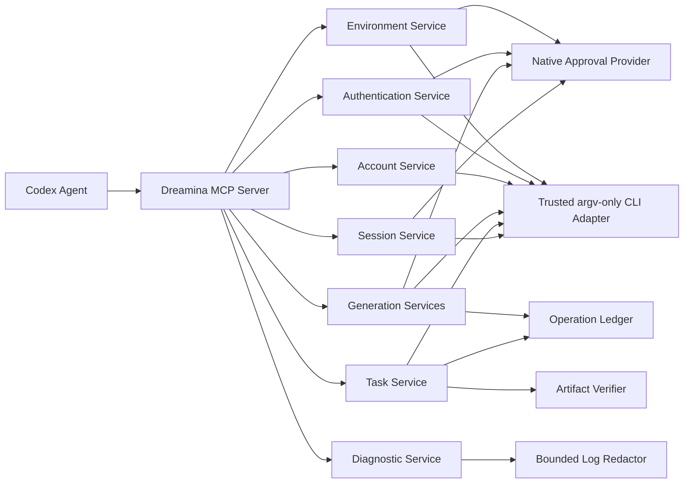
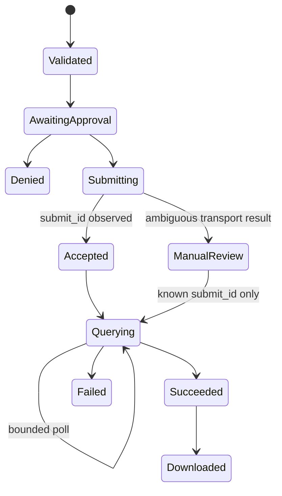

# Dreamina MCP Full Automation Design

**Date:** 2026-09-13  
**Status:** Approved design; implementation not started  
**Target release:** `0.3.0`  
**Specification source:** This document extends the existing Dreamina Design
plugin specification without replacing its paid-action, trust, recovery, or
artifact guarantees.

## 1. Goal

Expose the complete official Dreamina CLI lifecycle through typed Codex MCP
tools so an agent can automate installation readiness, authentication, account
inspection, every documented generation mode, task recovery and download,
Session CRUD, version checks, upgrades, and redacted log diagnosis.

The implementation must remove the current gap between Skill documentation and
MCP/Harness execution while preserving explicit authorization for software
installation, authentication-state changes, destructive Session operations,
and paid generation.

## 2. Scope

### 2.1 Included CLI capabilities

- Installation and upgrade through the official HTTPS installer endpoint.
- `version`, root help, and subcommand capability discovery.
- `login`, `login --headless`, `login checklogin`, `relogin`, and `logout`.
- `user_credit`.
- `text2image`, `image2image`, and `image_upscale`.
- `text2video`, `image2video`, `frames2video`, `multiframe2video`, and
  `multimodal2video`.
- `query_result`, verified local download, and `list_task` filtering.
- Session create, list, search, rename, and delete.
- Bounded, redacted inspection of `~/.dreamina_cli/logs/`.

### 2.2 Excluded

- Arbitrary shell execution or arbitrary caller-supplied argv.
- Dreamina private APIs or browser automation that bypasses OAuth/Web consent.
- Storage or return of OAuth tokens, cookies, raw device credentials, or
  unredacted logs.
- Automatic paid resubmission after timeout, transport ambiguity, or process
  failure.
- Silent installation, silent upgrade, silent logout, or silent Session
  deletion.

## 3. Architecture

The MCP server remains dependency-free and stdio-based. Domain services own
command construction and validation; the server owns schema dispatch and
authorization routing; `DreaminaAdapter` remains the only subprocess boundary.

## 4. Public MCP tool model

### 4.1 `dreamina_capability_snapshot`

Retain the existing read-only capability tool without breaking its current
request or response fields. Internally it may reuse the status service, but it
remains the compatibility entry point for live model/mode constraints.

### 4.2 `dreamina_cli_status`

Read-only, idempotent tool for installation state, trusted enrollment state,
version, root help summary, and optional command capability discovery.

Inputs:

- `command`: optional enum of documented CLI command names.
- `detail`: `summary` or `full`.

It must never install or modify trust configuration. When the CLI is absent or
not enrolled, it returns a structured next action rather than a raw traceback.

### 4.3 `dreamina_cli_install_or_upgrade`

State-changing, non-idempotent tool with actions `install` and `upgrade`.

Workflow:

1. Download the installer from the fixed official HTTPS URL to a private
   temporary directory without invoking a shell pipeline.
2. Enforce response size, redirect, scheme, and final-host rules.
3. Compute SHA-256 and return/display the operation scope.
4. Obtain native approval bound to action, URL, digest, and destination.
5. Execute the downloaded installer with a minimal environment and bounded
   output.
6. Resolve the installed executable, perform native trusted-CLI enrollment,
   then verify `version` and root help.

No caller-supplied installer URL, command, shell fragment, destination, or
digest override is accepted.

### 4.4 `dreamina_auth`

Typed authentication tool with actions:

- `login`: blocking interactive device flow; user completes authorization in
  the external browser.
- `login_headless`: starts headless flow and returns only the minimum
  user-facing verification fields.
- `check_login`: accepts an opaque `flow_id` and bounded poll duration.
- `relogin`: native confirmation, then clear and restart local OAuth state.
- `logout`: native confirmation before clearing local OAuth state.

For headless login, the MCP process keeps the CLI `device_code` only in memory
for at most ten minutes and returns a random single-use `flow_id`, the
verification URI, and the user-visible code. `check_login` consumes `flow_id`
and never accepts or returns a raw device code. Process exit drops every flow.
Device codes are never persisted in plugin state or logs. Login success must be
verified with `user_credit`; failure returns a concrete next action.

### 4.5 `dreamina_account`

Read-only wrapper for `user_credit`. It returns non-secret account readiness,
membership/benefit availability, and credit fields exposed by the CLI. It must
redact tokens, cookies, device codes, authorization URLs containing secrets,
and unknown credential-shaped fields.

### 4.6 `dreamina_submit_image`

The existing paid image tool expands its mode enum to:

- `text2image`
- `image2image`
- `image_upscale`

`image_upscale` requires one validated image reference and a runtime-supported
`resolution_type`; prompt, model, ratio, and count are forbidden for that mode.
The request fingerprint and native approval include the exact mode, reference
digest, resolution, destination, and any expected credit scope.

### 4.7 `dreamina_submit_video`

The existing paid video tool expands to include `multiframe2video`.

The service must support:

- 2–20 validated ordered image references.
- Runtime-discovered resolution and duration limits.
- No invented `model_version` or ratio when the live CLI omits them.
- For N images, either no explicit transitions or exactly N−1 transition
  descriptions and durations, using the CLI's observed flag names.
- Fingerprinting and approval of reference order and every transition.

The existing four video modes retain backward-compatible request behavior.

### 4.8 `dreamina_query_task`

Read-only query by `submit_id`, with an optional verified download operation.

Inputs:

- `submit_id`: required non-empty identifier.
- `poll_seconds`: bounded wait, default zero.
- `download_dir`: optional destination under caller-declared approved roots.

The tool consults the operation ledger first. It never resubmits. Downloads use
the CLI `query_result --download_dir` path and the existing artifact verifier.
Unknown submit IDs may be queried without importing them into the paid ledger,
but downloaded artifacts must be marked externally queried rather than falsely
claimed as plugin-submitted.

### 4.9 `dreamina_list_tasks`

Read-only, paginated/filterable wrapper for `list_task`. Accepted filters must
be discovered from current help or constrained to documented fields. Responses
must impose item and byte limits.

### 4.10 `dreamina_session`

Typed Session tool with actions:

- `create`
- `list`
- `search`
- `rename`
- `delete`

`list` and `search` are read-only operations. Create, rename, and delete require
native approval bound to action and exact arguments. Delete must present the
resolved Session identity and refuse default Session `0` unless the live CLI
explicitly proves it is deletable and the user separately confirms that exact
target.

### 4.11 `dreamina_diagnose`

Read-only diagnostic tool that combines:

- exact command supplied by the caller as inert display text;
- error description as inert display text;
- CLI version/status;
- optional `submit_id`;
- bounded recent log excerpts from `~/.dreamina_cli/logs/`.

It accepts no arbitrary file path. Log files must be regular non-symlink files
inside the fixed log root. Selection is bounded by time, file count, per-file
bytes, and total output bytes. Redaction occurs before output and covers common
tokens, cookies, authorization headers, device/user codes, URLs with sensitive
query values, and credential-shaped JSON fields.

## 5. Authorization matrix

| Operation | MCP approval mode | Native confirmation | Idempotency |
|---|---|---|---|
| Status/version/help | approve | no | idempotent |
| Account/query/list/search/diagnose | approve | no | idempotent |
| Install/upgrade | prompt | yes | non-idempotent |
| Interactive/headless login/check | prompt | user completes OAuth; no synthetic approval | conditional |
| Relogin/logout | prompt | yes | non-idempotent |
| Paid image/video/upscale | prompt | yes, exact request | non-idempotent |
| Session create/rename/delete | prompt | yes, exact action | non-idempotent |
| Download | approve | path policy enforcement | query-idempotent, filesystem write |

`.mcp.json` must enumerate every tool explicitly. The server must not depend on
MCP metadata alone for high-risk operations; native confirmation is the
server-side enforcement boundary.

## 6. Command construction and output contract

- Every command is constructed from fixed tokens and closed enum/action
  dispatch. No command string is evaluated by a shell.
- Input schemas use `additionalProperties: false` with length, range, enum,
  collection-size, and mutually-exclusive-field constraints where possible.
- Domain validation handles constraints JSON Schema cannot express.
- Each tool returns `structuredContent` plus a concise text representation.
- Errors are structured as `error_type`, `message`, `retryable`,
  `requires_user_action`, and `next_action`; secrets are removed before both
  structured and text output.
- Output size is bounded at both adapter and MCP response layers.

## 7. Recovery and consistency

- Paid submissions preserve the existing durable intent-before-invocation
  behavior.
- Ambiguous submission never retries automatically.
- Authentication and Session mutations return observed CLI results and do not
  invent rollback success. Where rollback is not supported, errors state the
  required manual recovery.
- Install/upgrade failure preserves installer digest and bounded diagnostics but
  never records the CLI as trusted until version/help verification succeeds.

## 8. Implementation boundaries

Recommended modules:

- `scripts/environment_service.py`
- `scripts/auth_service.py`
- `scripts/account_service.py`
- `scripts/task_service.py`
- `scripts/session_service.py`
- `scripts/diagnostic_service.py`
- focused extensions to `image_service.py`, `video_service.py`,
  `dreamina_adapter.py`, and `dreamina_mcp_server.py`

Each service owns one command family and exposes typed methods. The MCP server
must remain a thin router; it must not accumulate inline command construction,
log parsing, download verification, or authorization logic.

## 9. Compatibility and release

- Keep existing MCP tool names and existing request fields valid.
- New modes and tools are additive.
- Bump plugin version from `0.2.1` to `0.3.0` because the public MCP capability
  surface materially expands.
- Update router Skill instructions to prefer MCP automation and explain which
  actions pause for native/user confirmation.
- Do not modify the 13 upstream Skill trees unless an actual instruction gap is
  found; preserve pinned upstream parity.

## 10. Test and acceptance gates

### 10.1 TDD

For each domain, add a failing test before implementation. Tests use a private
synthetic CLI and assert exact argv, schema closure, output redaction,
authorization behavior, timeout handling, and absence of resubmission.

### 10.2 Required automated evidence

- MCP inventory exposes all eleven tools with correct schemas and annotations.
- Every official CLI command category maps to an executable MCP handler.
- `multiframe2video` and `image_upscale` reach the adapter with exact validated
  argv.
- Login/headless/check/relogin/logout cover success, denial, timeout, malformed
  output, and sensitive-value redaction.
- Session CRUD covers exact action routing, default-session protection, denial,
  and CLI failures.
- Query/list/download cover pagination/limits, unknown submit ID behavior,
  traversal/symlink rejection, and no resubmission.
- Installer tests cover wrong host, redirect escape, oversize response,
  download failure, denial, nonzero execution, and successful trust enrollment.
- Diagnostic tests cover path escape, symlink, output caps, and secret patterns.
- Existing approval, operation, artifact, distribution, and security suites stay
  green.

### 10.3 Runtime evidence

- Run real read-only status/version/help, account readiness, task list, Session
  list/search, and bounded redacted diagnosis.
- Do not run install/upgrade if the current CLI is already current solely for
  testing.
- Do not change OAuth state or Sessions without separate action-time approval.
- Do not run paid generation merely to validate the new wrappers; reuse existing
  successful canary evidence unless a separately approved new mode canary is
  required.

### 10.4 Release gate

- Full unit/integration suite passes.
- Strict TRACE and official plugin validation pass.
- Security review reports no Critical, High, or production-blocking Medium
  findings.
- Public Marketplace installation contains version `0.3.0` and all eleven tools.
- A fresh Codex task calls representative read-only tools from the installed
  plugin.
- Local, tracking, and remote commit SHAs match and GitHub CI is successful.

## 11. Definition of done

The feature is complete only when every command category in the user's original
coverage table is `Skill documentation: yes` and `MCP/Harness executable: yes`,
subject to explicit confirmation for high-risk actions. Documentation-only
coverage, handler existence without tests, compilation, or a successful paid
image canary alone is insufficient.
