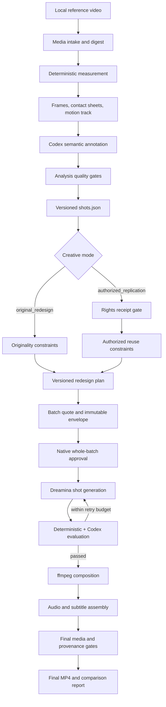
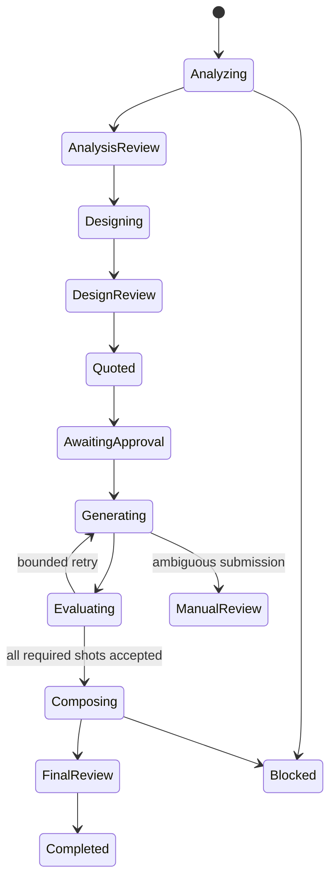

# Dreamina Reference Video Re-Director Design

**Date:** 2026-09-14
**Status:** Approved for implementation planning; implementation not started
**Target release:** `0.4.0`
**Change type:** Additive architecture extension
**Reference project:** `eternityspring/reelbench-skills` at commit
`75520c7b32ab5af8b22c5e4f79705efbbc0d8e07`, Apache-2.0

## 1. Product definition

Dreamina Design remains a safe, automated Dreamina CLI integration and gains a
new product-level workflow:

> Analyze a reference video deterministically, reconstruct its cinematic and
> narrative grammar, produce either an original redesign or an authorized
> replication plan, generate and evaluate every shot through Dreamina, rebuild
> audio and subtitles, and compose a verified final MP4.

This is a new capability, not a replacement. The existing 11 MCP tools, 13
upstream Dreamina Skills, request schemas, approval behavior, CLI automation,
and recovery contracts remain available and backward compatible.

## 2. Goals and non-goals

### 2.1 Goals

- Convert a local reference video into machine-grounded shot data.
- Separate measurable evidence from model-authored semantic judgments.
- Support two explicit creative modes: original redesign and authorized
  replication.
- Produce a versioned redesign plan that can drive Dreamina generation.
- Approve the complete paid batch against a non-expandable budget envelope.
- Generate, resume, evaluate, and selectively retry each shot.
- Rebuild audio and subtitles according to a user-selectable policy.
- Compose a final MP4 with deterministic media verification and provenance.
- Preserve intermediate artifacts so a stopped workflow can resume safely.

### 2.2 Non-goals

- No arbitrary command, Python, ffmpeg filter, shell, or Dreamina argv input.
- No automatic claim that a user owns copyright, likeness, voice, music, or
  trademark rights.
- No default cloning of identifiable people, protected characters, brands,
  dialogue, music, or distinctive visual assets.
- No paid generation before a complete design, quote, and batch approval.
- No automatic resubmission when a Dreamina submit result is ambiguous.
- No hidden cloud ASR, TTS, vision, or storage dependency.

## 3. Confirmed product decisions

### 3.1 Dual creative modes

`original_redesign` is the default:

- May preserve abstract timing, pacing, shot-size distribution, camera-motion
  grammar, narrative function, and transition rhythm.
- Must replace people, settings, dialogue, brand identifiers, copyrighted
  artwork, distinctive props, and source audio unless independently supplied
  and authorized.
- Produces a similarity audit showing which structural attributes were retained
  and which expressive elements were replaced.

`authorized_replication` is opt-in:

- Requires a separate rights receipt before redesign or generation.
- The receipt records the declarant, work identity, rights basis, allowed media
  types, allowed likenesses/voices/brands, territory or audience restriction,
  purpose, expiry, and evidence references supplied by the user.
- The receipt is bound to the source digest, project ID, creative mode, design
  version, permitted reuse dimensions, and final batch fingerprint.
- Missing, expired, or scope-mismatched rights fail closed.
- The plugin records a user assertion and engineering evidence; it does not
  provide legal advice or independently prove ownership.

### 3.2 Complete output loop

The first release covers analysis, redesign, shot generation, evaluation,
bounded retries, ffmpeg composition, audio, subtitles, final MP4 validation,
and a source-versus-output structure report.

### 3.3 Selectable audio policy

The user selects one of:

- `full_redesign` — default. Local ASR extracts source content and timing only;
  new script, narration, subtitles, sound design, and licensed/user-supplied
  music are assembled for the redesign.
- `preserve_authorized_audio` — authorized replication only and only when the
  rights receipt explicitly includes dialogue, voices, music, and sound.
- `subtitles_only` — generate a rewritten subtitle timeline; retain authorized
  source audio or use silence.
- `silent` — compose video with no audio track and optional subtitles.

Local ASR availability is discovered. Absence produces an explicit blocked or
degraded state; it never yields a fabricated transcript. The initial provider
contract supports a local Whisper-compatible CLI through a trusted executable
enrollment. Audio redesign uses a provider interface for narration plus
user-supplied licensed music/effects. A platform-local TTS implementation may
be provided, but is never presented as a source-voice clone.

### 3.4 Whole-batch budget approval

Before generation, the plugin shows and fingerprints:

- analysis and design IDs and versions;
- creative and audio modes;
- shot count and total target duration;
- per-shot Dreamina mode, model, resolution, duration, reference set, and
  maximum attempts;
- expected task count, reserved retry count, and maximum budget;
- output resolution, frame rate, audio/subtitle policy, and destination.

One native approval authorizes only that envelope. The execution may reduce
scope, skip shots, or consume less. It may not add shots, use a more expensive
model, raise resolution, extend duration, add attempts, change rights scope, or
exceed the maximum budget. Any expansion invalidates the approval and requires
a new quote and confirmation.

## 4. Architecture



### 4.1 Responsibility split

| Responsibility | Deterministic code | Codex/model judgment |
|---|---|---|
| Media identity | SHA-256, size, codec, dimensions, duration, fps | none |
| Shot boundaries | ffmpeg scene scores, timestamps, recut operations | flag suspected misses from contact sheets |
| Motion evidence | sampled frame-difference track and per-shot statistics | camera-movement label constrained by evidence |
| Shot semantics | schema and enum validation | size, category, camera, frame, rhythm, subjects, text |
| Audio evidence | waveform/timing, ASR provider output and confidence | rewritten script and intended sound role |
| Redesign | structural constraints and originality/rights gates | new visual, narrative, dialogue, and sound design |
| Generation | quote, approval, task ledger, Dreamina calls | prompt and mode selection within live capabilities |
| Evaluation | duration, dimensions, codec, frame hashes, artifact checks | semantic fidelity, continuity, composition, defects |
| Composition | fixed ffmpeg graph from closed options | user-approved edit and sound intent |

The MCP server never calls an undisclosed remote model. Codex performs semantic
annotation and creative design through Skills using contact sheets and
structured schemas; MCP tools prepare evidence, validate model-authored data,
persist versions, enforce approvals, run Dreamina, and compose media.

## 5. Python-native analysis subsystem

The Reelbench implementation is not vendored. The plugin reimplements the
architecture in Python using existing plugin conventions and subprocess
boundaries.

### 5.1 Media intake

- Input must be an absolute regular non-symlink file under an approved root.
- Open with `O_NOFOLLOW`, record inode metadata, stream SHA-256, then stage a
  private read-only copy for analysis.
- Allowlist MP4, MOV, and WebM based on bytes and ffprobe, not filename alone.
- Default maximum duration and size are configurable closed limits; exceeding
  them returns a clear segmentation action.
- The project receives a random ID and private mode `0700` directory.

### 5.2 Deterministic measurement

The analyzer invokes fixed ffprobe/ffmpeg argv to produce:

- media metadata;
- scene-score candidates;
- normalized seed cuts;
- a sampled motion track;
- per-shot start, end, duration, and motion statistics;
- two keyframes per shot at safe interior percentages;
- paginated start/end contact sheets.

Threshold and minimum-shot controls are bounded. Manual `split` and `merge`
operations are typed, versioned recuts; callers cannot edit measured fields.

### 5.3 Semantic annotation

The generated work package supplies contact sheets, measured rows, allowed
taxonomies, and a closed annotation schema. Codex fills only semantic fields:

- shot size;
- narrative category;
- camera movement;
- visible frame description;
- rhythm role and evidence;
- subjects;
- on-screen text;
- dialogue, narration, music, and sound observations;
- confidence and review notes.

The plugin never presents these judgments as machine measurements.

### 5.4 Analysis quality gates

Gates include timeline continuity, duration arithmetic, sequential IDs,
taxonomy validity, frame-description specificity, duplicate descriptions,
subject/cast consistency, category evidence, motion-versus-camera consistency,
declared-boundary provenance, required keyframes, complete optional rhythm
annotation, ASR timing/confidence provenance, and immutable machine fields.

Skipped gates are recorded as skipped, never passed. Blocking violations must
be resolved before redesign.

## 6. Redesign subsystem

### 6.1 Project contract

Each redesign contains:

- source analysis reference;
- creative mode and rights receipt reference where required;
- audience, format, target duration, aspect ratio, and platform;
- new concept, cast, settings, palette, visual style, dialogue, narration,
  music, and sound intent;
- structural preservation policy;
- shot-by-shot design;
- cross-shot continuity rules;
- originality or authorized-similarity audit;
- version, parent version, author, timestamp, and fingerprint.

### 6.2 Structural preservation policy

The user can preserve or relax independently:

- shot count;
- per-shot timing tolerance;
- shot-size sequence;
- narrative-category sequence;
- camera-motion sequence;
- rhythm-role sequence;
- transition pattern;
- audio beat locations.

`original_redesign` defaults to preserving timing/rhythm grammar while
replacing expressive content. `authorized_replication` may preserve additional
dimensions only if the rights receipt permits each dimension.

### 6.3 Shot generation planning

Each designed shot selects one live Dreamina mode:

- `text2video` for independent environment, transition, or establishing shots;
- `image2video` when a single approved character or style reference anchors the
  shot;
- `frames2video` when exact start/end continuity matters;
- `multiframe2video` for short storyboard sequences with ordered transitions;
- `multimodal2video` when authorized video/audio references are necessary.

Reference images can be generated through the existing image tools. Model,
resolution, duration, ratios, and reference limits come only from the live
capability snapshot.

## 7. Generation, evaluation, and retry

### 7.1 Durable orchestration

The project ledger records every phase and version:



Every generated shot keeps stable design, attempt, submit, artifact, evaluation,
and cost identities. Process restart resumes from the ledger.

### 7.2 Evaluation gates

Deterministic gates verify artifact integrity, dimensions, codec, duration
tolerance, aspect ratio, frame readability, start/end continuity anchors, and
absence of truncation. Codex evaluates semantic intent, composition, identity
continuity, visual defects, camera behavior, rhythm function, subtitle-safe
areas, and mode-specific constraints through a closed evaluation schema.

Retry rules are explicit and explain the failed gates. Automatic retry is
allowed only inside the approved attempt and budget envelope. Ambiguous
Dreamina submission states remain query-only.

## 8. Audio and subtitle subsystem

### 8.1 Source analysis

ffmpeg extracts a normalized analysis waveform. A trusted local
Whisper-compatible provider returns transcript segments with start/end,
language, text, and confidence. Low-confidence segments are flagged for human
or Codex review. ASR output is evidence, not truth.

### 8.2 Full redesign default

- Codex creates new dialogue/narration aligned to redesign beats.
- A local narration provider generates new voiceover or the user supplies a
  licensed narration track.
- User-supplied licensed music and effects may be mixed through closed options.
- No source voice cloning is attempted.
- Subtitles are generated from the approved rewritten script and narration
  timing, not copied blindly from source ASR.

### 8.3 Authorized source audio

Source audio reuse is allowed only when `authorized_replication` rights include
each requested audio class. The composed receipt records whether dialogue,
voice performance, music, effects, and ambience were retained, replaced, or
removed.

### 8.4 Composition

The composition service builds a fixed ffmpeg filter graph from closed options:

- ordered shot concatenation;
- optional bounded crossfades;
- audio trim/mix/duck/fade;
- loudness normalization;
- subtitle mux or burn-in;
- target resolution, frame rate, and codec profile;
- optional title/end card generated from user-authored content.

Callers cannot submit raw ffmpeg arguments or filter expressions.

## 9. Additive MCP and Skill surface

The existing 11 tools remain unchanged. New workflow tools are additive:

| Tool | Purpose | Risk |
|---|---|---|
| `dreamina_video_project` | create, inspect, list, and resume projects | create is local write |
| `dreamina_analyze_reference_video` | intake, measure, frames, sheets, recut | local media processing |
| `dreamina_validate_shot_analysis` | validate and persist semantic annotation | local write |
| `dreamina_create_redesign` | validate and persist either creative mode | rights-sensitive local write |
| `dreamina_quote_video_batch` | calculate immutable generation envelope | read-only/no spend |
| `dreamina_approve_video_batch` | record rights and whole-budget approval | high-risk confirmation |
| `dreamina_execute_video_batch` | submit/resume bounded paid generation | paid/open-world |
| `dreamina_evaluate_video_batch` | validate artifacts and persist judgments | local/read media |
| `dreamina_compose_video` | ASR/audio/subtitles/ffmpeg final assembly | local media write |
| `dreamina_export_video_project` | emit final MP4, reports, and receipts | destination write |

The router Skill gains an additive “reference video re-direct” route and
orchestrates Codex-only semantic/creative steps. Existing prompt and direct
generation Skills are not replaced or copied.

## 10. Authorization model

| Gate | Original redesign | Authorized replication |
|---|---|---|
| Source processing assertion | required | required |
| Additional rights receipt | not required | required and scope-bound |
| Design approval | required | required |
| Whole-batch budget approval | required | required |
| Retry within envelope | automatic | automatic |
| Budget/scope expansion | new approval | new approval and rights recheck |
| Source audio reuse | forbidden by default | allowed only by explicit scope |
| Final export | destination confirmation | destination and rights confirmation |

Approvals are opaque, expiring, single-use for activation, and bound to hashes.
Activating a batch creates a durable non-expandable allowance consumed by each
attempt. A batch cannot be edited after activation; redesign creates a new
version and quote.

## 11. Artifacts and schemas

Each project contains private, versioned artifacts:

```text
project.json
source/source-receipt.json
analysis/v001/media.json
analysis/v001/track.json
analysis/v001/shots.json
analysis/v001/frames/
analysis/v001/sheets/
analysis/v001/validation.json
rights/rights-receipt.json
design/v001/design.json
design/v001/similarity-audit.json
batch/v001/quote.json
batch/v001/approval.json
batch/v001/operations/
batch/v001/evaluations/
audio/v001/transcript.json
audio/v001/audio-plan.json
compose/v001/composition.json
output/final.mp4
output/final-receipt.json
output/comparison-report.html
```

Every JSON artifact has a closed versioned schema, canonical fingerprint,
parent references, timestamps, and provenance. Machine evidence and model
judgments remain separate fields.

## 12. Security, privacy, and compliance

- All media paths use approved roots, regular-file checks, no symlinks, private
  staging, byte-based type detection, size/duration caps, and streaming hashes.
- ffmpeg, ffprobe, ASR, and narration executables require trusted enrollment;
  invocation is argv-only with bounded stdout/stderr, time, and process groups.
- Source videos, frames, transcripts, likeness notes, and rights evidence are
  private by default and excluded from plugin distribution and logs.
- Reports redact filesystem/user identity unless the user selects a local
  private report containing those paths.
- The system detects and flags requested reuse of faces, voices, brands,
  copyrighted characters, dialogue, music, and visible watermarks.
- `authorized_replication` cannot be activated by a Boolean alone; it requires a
  complete guard-issued engineering receipt and exact scope matching.
- Rights receipts represent user assertions and supplied evidence, not legal
  verification. High-risk uncertainty stops before paid generation/export.

## 13. Reelbench engineering-compliance disposition

This section is engineering compliance triage, not legal advice.

| Field | Decision |
|---|---|
| coordinate | Git repository `eternityspring/reelbench-skills` commit `75520c7b32ab5af8b22c5e4f79705efbbc0d8e07` |
| declared license | Apache-2.0 via repository LICENSE and GitHub metadata |
| use mode | architectural reference; Python-native reimplementation; no initial vendoring |
| decision | conditionally acceptable |
| obligations | record attribution and fixed commit; preserve applicable NOTICE/license for any later copied/adapted expression; document modifications |
| action | add a provenance reference and `THIRD_PARTY_NOTICES.md` entry before release |

No source file may be copied merely because the repository is Apache-2.0. Any
later direct adaptation must be identified file-by-file, reviewed for NOTICE and
copyright headers, tested independently, and recorded in the distributed
third-party notice.

## 14. Testing and evaluation

### 14.1 Deterministic tests

- Synthetic media fixtures for hard cuts, dissolves, black frames, long takes,
  variable frame rate, no audio, corrupt/truncated data, and path attacks.
- Property tests for continuous timelines, recut renumbering, immutable machine
  evidence, fingerprints, and non-expandable budgets.
- All analysis quality gates have both passing and defeating fixtures.
- Rights scope tests cover missing fields, expiry, source/design mismatch,
  insufficient audio/likeness/brand rights, and approval replay.
- Generation tests use synthetic Dreamina CLIs and prove stable identities,
  bounded retries, no blind resubmission, and exact allowance consumption.
- Composition tests verify exact argv/filter construction, duration, streams,
  loudness, subtitles, and artifact receipts without arbitrary filters.

### 14.2 Agent evaluations

- Contact-sheet annotation scenarios with known shot taxonomy and motion
  evidence.
- Original redesign scenarios that must preserve structure while replacing
  expressive content.
- Authorized replication scenarios that must stop or proceed based on receipt
  scope.
- Shot evaluation scenarios for identity drift, unwanted source copying,
  camera mismatch, temporal artifacts, and subtitle-safe composition.
- Resume scenarios at every durable state.

### 14.3 Runtime acceptance

- Analyze a short user-authorized local fixture end to end without paid calls.
- Produce and validate both redesign modes; replication uses a synthetic rights
  fixture unless a user supplies real evidence for an action-time test.
- Quote a complete batch and verify that every scope expansion invalidates it.
- Run one separately approved minimal whole-batch canary only after offline
  gates pass.
- Compose and verify a final MP4 with audio/subtitle provenance.
- Reinstall from the public Marketplace and run a fresh-task workflow.

## 15. Compatibility and rollout

- Release as `0.4.0` because the plugin gains a new product subsystem and MCP
  surface while keeping `0.3.0` tools compatible.
- Phase the implementation internally but publish only when the complete loop
  meets the release gate.
- Node and Chrome are not runtime dependencies of this Python-native design.
- ffmpeg/ffprobe are required for analysis and composition; ASR/narration
  providers are capability-discovered and can block or degrade according to the
  selected audio policy.
- Rollback disables the new workflow tools and preserves existing `0.3.0`
  direct Dreamina automation and its stored operations.

## 16. Definition of done

The change is complete only when:

- all existing `0.3.0` behavior and tests remain green;
- the ten additive workflow tools are executable through installed MCP;
- both creative modes enforce their distinct content and rights contracts;
- local video analysis separates machine evidence from model judgments;
- the complete batch quote and non-expandable budget approval are proven;
- every shot reaches accepted, failed, skipped, or manual-review state without
  hidden resubmission;
- selected audio policy and subtitle provenance are reflected in the final MP4;
- final MP4 and comparison report pass deterministic verification;
- licensing attribution and fixed reference commit are present;
- security review has no Critical, High, or production-blocking Medium issue;
- full tests, agent evaluations, TRACE, plugin validation, public installation,
  fresh-task acceptance, remote CI, and SHA equality all pass.
