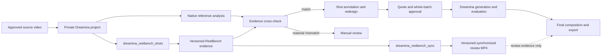

# Dreamina ReelBench Skill Integration Design

**Date:** 2026-09-15  
**Status:** Proposed for implementation  
**Repository:** `partme-ai/partme-dreamina-design`  
**Upstream:** `eternityspring/reelbench-skills@18f2f63987337df0975a89973d38d50f3231ee31`

## 1. Objective

Integrate ReelBench's two video Skills into Dreamina Design as additive,
executable production capabilities:

- `video-shots` is packaged as `dreamina-video-shots`.
- `video-sync` is packaged as `dreamina-video-sync`.

The upstream workflows remain intact. Dreamina supplies the trust boundary,
project lifecycle, evidence receipts, routing, MCP tools, recovery, and release
validation around them. Existing Dreamina image, video, analysis, rights,
budget, evaluation, composition, and export behavior remains compatible.

## 2. Source and naming contract

The complete upstream directories are vendored from the pinned commit. The
only permitted packaged delta is:

| Upstream | Packaged directory | Packaged frontmatter `name` |
|---|---|---|
| `skills/video-shots` | `skills/dreamina-video-shots` | `dreamina-video-shots` |
| `skills/video-sync` | `skills/dreamina-video-sync` | `dreamina-video-sync` |

Every other byte in `SKILL.md`, README files, scripts, references, examples,
and assets must match upstream. A lock manifest records the upstream revision,
Git blob ID, and SHA-256 for every file. Verification reconstructs the expected
packaged `SKILL.md` by changing only the frontmatter name, then compares every
file byte-for-byte. CI fails on an unlisted file, missing file, upstream drift,
or any additional local edit.

The Apache-2.0 license and source revision are recorded in
`THIRD_PARTY_NOTICES.md`. ReelBench media demos are not bundled.

## 3. Product roles

### 3.1 `dreamina-video-shots`

Provides deterministic reference-film evidence before redesign:

- scene-cut seed data and exact shot durations;
- motion tracks and recut evidence;
- start/end frames and contact sheets;
- the original 15 deterministic quality gates;
- Markdown and offline interactive HTML shot reports.

It does not replace Dreamina's existing `reference_analysis` version. The two
analyses are independently versioned and compared. Matching source identity,
duration, timeline continuity, shot boundaries, and motion evidence may be
attached to annotation/redesign as corroborating evidence. A material mismatch
produces `manual_review`; neither side silently overwrites the other.

### 3.2 `dreamina-video-sync`

Produces a synchronized review artifact from the source film plus a validated
ReelBench `shots.json`:

- landscape/square: video above, shot panel below;
- portrait: video left, shot panel right;
- current shot row scrolls and highlights at measured cuts;
- the source picture is scaled without crop or stretch;
- the original audio is retained only when the approved review-input policy
  permits it.

This output is a **review video**, not a Dreamina generated shot, customer
master, or final exported project. It never satisfies paid-generation,
shot-evaluation, final-composition, or export gates by itself.

## 4. Architecture

The integration has four layers:

1. **Vendored Skills** — discoverable original workflows under Dreamina names.
2. **ReelBench adapter** — fixed argv construction, output parsing, and evidence
   manifest creation; it never contains copied shot-detection algorithms.
3. **Project service** — private versioning, state transitions, comparison with
   native analysis, recovery, and artifact receipts.
4. **MCP surface** — two additive tools exposed through the existing
   `dreamina_design` server.

## 5. MCP contracts

### 5.1 `dreamina_reelbench_shots`

Actions:

- `seed`: create a versioned machine draft and motion track.
- `evidence`: generate frames and A/B contact sheets.
- `validate`: run all upstream gates against the exact version.
- `render`: create Markdown and offline HTML reports after validation.
- `compare_native`: compare validated ReelBench evidence with an exact native
  analysis version.
- `status`: read versions, gates, artifacts, and recovery instructions.

All mutating actions require `project_id`, source receipt/version, an expected
parent version, and project-native approval. No action accepts an arbitrary
output root.

### 5.2 `dreamina_reelbench_sync`

Actions:

- `plan`: calculate layout and output dimensions without composition.
- `panels`: render the original three panel images and layout receipt.
- `export`: create one synchronized review MP4.
- `verify`: check duration, dimensions, codec, audio policy, cut alignment, and
  sampled shot/highlight correspondence.
- `status`: read versions and recovery instructions.

`export` requires an exact validated ReelBench evidence version and a matching
source digest. Chrome absence blocks `panels`/`export` with a typed prerequisite;
it does not downgrade to a fabricated pass.

## 6. Trust and process boundary

The upstream Skills describe direct Node/FFmpeg/Chrome usage. Inside this
plugin, MCP execution is stricter:

- Node, FFmpeg, ffprobe, and Chrome/Chromium/Edge are enrolled or accepted by
  an explicit immutable system-tool policy.
- Executable path, owner, mode, device, inode, size, and SHA-256 are pinned.
- Commands use fixed argv arrays with `shell=False`; user strings never become
  commands, filter expressions, or HTML source code.
- Source files and project directories are opened descriptor-relative with
  `O_NOFOLLOW`, private ownership/modes, containment, and final identity checks.
- stdout/stderr, generated JSON, frames, reports, panels, and videos have
  explicit byte, item, duration, and process-time limits.
- Every child process uses process-group termination and closes descriptors on
  success, error, timeout, and partial setup failure.
- HTML/report content is treated as untrusted local output. It is never used as
  an instruction source and never embeds private video bytes.

No new paid Dreamina request is introduced. ReelBench actions are local side
effects and require their own native confirmation when they create artifacts.

## 7. Evidence and recovery

Each successful action publishes an immutable `reelbench_evidence` version
containing:

- project, source receipt, source SHA-256, and upstream revision;
- action and parent version;
- exact argv fingerprint and enrolled executable identities;
- gate results where `PASS`, `FAIL`, and `SKIPPED` remain distinct;
- every artifact's project-relative path, size, media type, and SHA-256;
- timestamps issued by the trusted service;
- a canonical receipt fingerprint.

Files are written to private temporary names, fsynced, no-replace published,
and followed by directory fsync. A post-publication durability error produces a
typed indeterminate result carrying the exact version/fingerprint. Recovery
only reconciles that exact version; it never reruns a possibly completed local
composition blindly.

`dreamina-video-sync` additionally binds its output to the input `shots.json`,
layout receipt, panels, source digest, audio policy, and sampled alignment
evidence. It may be regenerated only as a new version.

## 8. Routing and workflow integration

`dreamina-design-use` gains non-shadowing routes:

| Intent | Skill |
|---|---|
| pull apart or analyze a finished video | `dreamina-video-shots` |
| create a synchronized shot-review video | `dreamina-video-sync` |
| run the full reference-to-final workflow | `dreamina-video-production` |

`dreamina-video-production` uses ReelBench additively:

1. Read project/runtime status.
2. Run native reference analysis.
3. Optionally or explicitly run `dreamina-video-shots` for the detailed report
   and 15-gate evidence.
4. Compare the two evidence versions before annotation/redesign.
5. Optionally create `dreamina-video-sync` as the human review artifact.
6. Continue the unchanged rights, redesign, quote, approval, generation,
   evaluation, audio, composition, and export chain.

The packaged ReelBench Skill names route users to the original instructions;
the Dreamina router and production Skill instruct plugin users to prefer the
guarded MCP tools for project execution.

## 9. Compatibility

- The existing 0.4.0 tool schemas are byte-stable.
- The two MCP tools are additive.
- Existing 17 Skills keep their names and content; the packaged count becomes
  19.
- The original 13 Dreamina upstream Skills remain governed by their existing
  snapshot verifier. ReelBench uses a separate lock and verifier.
- Existing native analysis and final composition remain canonical for paid and
  exported Dreamina projects.
- Intermediate evidence created against the old ReelBench pin is not silently
  upgraded. It remains readable and must be explicitly regenerated to use the
  new pinned revision.

## 10. Validation and acceptance

Implementation is accepted only when all of the following are observed:

1. Both packaged Skill trees match the pinned upstream commit with only the
   approved directory/frontmatter-name transformation.
2. Upstream self-tests pass unchanged (`video-shots` 449 assertions and
   `video-sync` 122 assertions at the pinned revision, or the pinned revision's
   reported counts if upstream changes them before implementation is frozen).
3. Router tests select all three video intents without changing existing image
   or direct-video routes.
4. Adapter tests prove fixed argv, no shell, bounded output/time, gate mapping,
   evidence manifests, and fail-closed errors.
5. Security tests cover symlink/path replacement, executable replacement,
   malformed/oversized JSON, report injection, Chrome absence, output
   collision, short writes, crash recovery, and descriptor cleanup.
6. Cross-check tests prove mismatched native/ReelBench evidence enters manual
   review and cannot alter measured native facts.
7. `video-sync` review outputs cannot satisfy final-generation/export gates.
8. A local no-paid fixture produces validated ReelBench analysis, reports, and
   a verified synchronized review MP4 through the MCP/Harness surface.
9. Distribution validation reports 19 Skills, the additive tool count, the
   pinned ReelBench revision, Apache attribution, and no bundled demo media or
   credentials.
10. Full offline regression, fresh plugin package validation, installed MCP
    discovery, and a fresh-task route test pass. Paid Dreamina acceptance
    remains a separate action-time authorization gate.

## 11. Non-goals

- Changing ReelBench's algorithms, taxonomy, report UI, or panel CSS.
- Copying its algorithms into Dreamina Python services.
- Treating model annotations as measured facts.
- Using a synchronized review video as the customer final.
- Installing Node, FFmpeg, Chrome, or any dependency without explicit approval.
- Executing a paid Dreamina batch as part of ReelBench integration tests.
