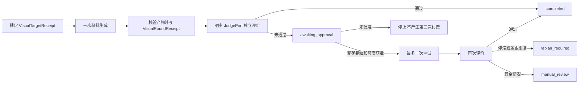

# Dreamina 视觉质量循环

> 版本：0.6.0  
> 状态：图片首轮评价、受额度约束的多轮修复、视频评价与 Blender/Maya 预览端口均已实现并通过本地测试；默认策略仍只允许一次重试。

## 运行边界

首轮评价由 `VisualLoopService` 在生成返回后立即调用，但失败只写入
`awaiting_approval`。它不会自行调用第二次生成。重试 allowance 同时绑定：

- 重试请求的规范化 SHA-256 指纹；
- 正整数信用额度上限；
- 审批者与一次性消费状态；
- 默认 `max_attempts=2`，即最多一次重试。

## 回执

`VisualTargetReceipt` 绑定目标文件 SHA-256、尺寸、媒体类型、来源与授权目录。
`VisualRoundReceipt` 绑定目标、请求、`submit_id`、产物哈希、Judge 身份、评分、
阻塞差距与下一动作。循环状态由 `visual_loop_state.schema.json` 校验，并以
0600 文件原子替换、目录 `fsync` 的方式保存。

## MCP 工具面

闭环经 `dreamina_visual_loop` 工具暴露，action 为 `create` / `lock_target` /
`run_first_round` / `run_retry` / `record_judgement` / `propose_retry` /
`approve_retry` / `status` / `stop`。

**一轮由两个调用组成**：`run_first_round`（或 `run_retry`）预留轮次并执行付费生成，
返回产物与 `judge_evidence`；评审由宿主的全新上下文子代理完成；再用
`record_judgement` 提交结构化结论并取得下一动作。之所以拆成两步，是因为生产服务是
stdio MCP 进程，无法在自身进程内启动子代理——评审必须由宿主提供，这与下面的
`JudgePort` 契约是同一件事的两面。

付费生成没有第二条通道：工具内部复用既有的 `dreamina_submit_image` 与
`dreamina_query_task` 处理器，因此用户审批、操作账本与 submit-once 保证与直接生成完全一致。
一次轮次在实现上是"提交 → 轮询 → 下载"三步，因为提交本身只返回 `submit_id` 而不落盘，
而轮次回执要求本地文件加内容摘要。

发现路径：`dreamina-design-harness` 的能力族与工作流、`dreamina-design-use` 路由，
以及 `commands/dreamina-visual-loop.md` 命令。

## 目标从哪来

目标素材可由用户提供，也可由系统取得：用户没给目标时，`dreamina-visual-target`
技能先走**基线精修**（以当前产物为输入生成改进版目标，使目标沿原方向收敛而非另起方向），
全新创作才直接生成。目标生成是一次付费提交，受既有审批门禁约束，无授权时失败关闭。
目标回执的 `source.kind` 区分 `user_supplied` / `generated` / `existing_artifact` /
`dcc_capture`，生成类记录真实 `submit_id`，可审计。目标是**可逐项对照的成品呈现**，
不是风格化演绎——这是评审四维可比对的前提。

## 修复实现的委托纪律

修复实现委托给 worker 子代理时：worker 全新空上下文（不 fork、不带历史）、
只接收"目标 + 当前状态 + 用户诉求"的高层指令（不派发逐条任务）、只实现不验收；
可运行性验证由编排者负责，视觉达标由独立评审判定；worker 不得自行发起循环或
任何付费提交。全文见 harness 的 `references/repair-delegation.md`。

## 跨客户端 Judge

业务层只依赖 `JudgePort.evaluate(evidence)`，不引用 Codex 子代理。Codex、
Claude Code、ZCode、Kimi 或其他 MCP 宿主可分别实现适配器，并必须返回闭合的
Judge 结构：provider、model、evaluated_at、rubric_version、score、gates、
blocking_gaps。缺字段、越界评分或非规范 JSON 都会失败关闭。

## 视频与 DCC

生产视频工具在报价时使用 `TrustedAnchorProvider` 固定关键帧证据，在评价时使用
`VideoEvaluationService` 复核媒体探测、首尾帧锚点与语义门禁。`DccPreviewPort`
由 `CompanionDccPreviewPort` 对接现有 Blender/Maya argv + JSON handoff；预览产物
会重新哈希、进入同一 Judge 与轮次回执链。没有已注册 companion 时仍失败关闭。

`ReplanPort` 只产生候选修复请求，不调用供应商。候选先持久化为精确请求指纹和
信用额度，再经过审批并消费 allowance。只有显式创建 `max_attempts=3` 的循环才
能进入第三轮；默认 `max_attempts=2` 不变。
